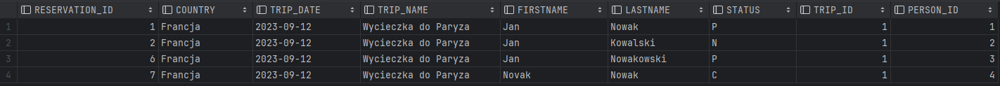
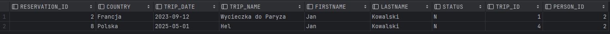
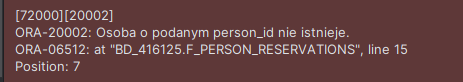

# Oracle PL/SQL

Imiona i nazwiska autorów : Tomasz Furgała, Konrad Tendaj, Łukasz Zegar

---
<style>
  {
    font-size: 16pt;
  }
</style> 

<style scoped>
 li, p {
    font-size: 14pt;
  }
</style> 

<style scoped>
 pre {
    font-size: 10pt;
  }
</style> 

# Tabele


- `Trip`  - wycieczki
	- `trip_id` - identyfikator, klucz główny
	- `trip_name` - nazwa wycieczki
	- `country` - nazwa kraju
	- `trip_date` - data
	- `max_no_places` -  maksymalna liczba miejsc na wycieczkę
- `Person` - osoby
	- `person_id` - identyfikator, klucz główny
	- `firstname` - imię
	- `lastname` - nazwisko


- `Reservation`  - rezerwacje
	- `reservation_id` - identyfikator, klucz główny
	- `trip_id` - identyfikator wycieczki
	- `person_id` - identyfikator osoby
	- `status` - status rezerwacji
		- `N` – New - Nowa
		- `P` – Confirmed and Paid – Potwierdzona  i zapłacona
		- `C` – Canceled - Anulowana
- `Log` - dziennik zmian statusów rezerwacji 
	- `log_id` - identyfikator, klucz główny
	- `reservation_id` - identyfikator rezerwacji
	- `log_date` - data zmiany
	- `status` - status


```sql
create sequence s_person_seq  
   start with 1  
   increment by 1;

create table person  
(  
  person_id int not null
      constraint pk_person  
         primary key,
  firstname varchar(50),  
  lastname varchar(50)
)  

alter table person  
    modify person_id int default s_person_seq.nextval;
   
```


```sql
create sequence s_trip_seq  
   start with 1  
   increment by 1;

create table trip  
(  
  trip_id int  not null
     constraint pk_trip  
         primary key, 
  trip_name varchar(100),  
  country varchar(50),  
  trip_date date,  
  max_no_places int
);  

alter table trip 
    modify trip_id int default s_trip_seq.nextval;
```


```sql
create sequence s_reservation_seq  
   start with 1  
   increment by 1;

create table reservation  
(  
  reservation_id int not null
      constraint pk_reservation  
         primary key, 
  trip_id int,  
  person_id int,  
  status char(1)
);  

alter table reservation 
    modify reservation_id int default s_reservation_seq.nextval;


alter table reservation  
add constraint reservation_fk1 foreign key  
( person_id ) references person ( person_id ); 
  
alter table reservation  
add constraint reservation_fk2 foreign key  
( trip_id ) references trip ( trip_id );  
  
alter table reservation  
add constraint reservation_chk1 check  
(status in ('N','P','C'));

```


```sql
create sequence s_log_seq  
   start with 1  
   increment by 1;


create table log  
(  
    log_id int not null
         constraint pk_log  
         primary key,
    reservation_id int not null,  
    log_date date not null,  
    status char(1)
);  

alter table log 
    modify log_id int default s_log_seq.nextval;
  
alter table log  
add constraint log_chk1 check  
(status in ('N','P','C')) enable;
  
alter table log  
add constraint log_fk1 foreign key  
( reservation_id ) references reservation ( reservation_id );
```


---
# Dane


Należy wypełnić  tabele przykładowymi danymi 
- 4 wycieczki
- 10 osób
- 10  rezerwacji

Dane testowe powinny być różnorodne (wycieczki w przyszłości, wycieczki w przeszłości, rezerwacje o różnym statusie itp.) tak, żeby umożliwić testowanie napisanych procedur.

W razie potrzeby należy zmodyfikować dane tak żeby przetestować różne przypadki.


```sql
-- trip
insert into trip(trip_name, country, trip_date, max_no_places)  
values ('Wycieczka do Paryza', 'Francja', to_date('2023-09-12', 'YYYY-MM-DD'), 3);  
  
insert into trip(trip_name, country, trip_date,  max_no_places)  
values ('Piekny Krakow', 'Polska', to_date('2025-05-03','YYYY-MM-DD'), 2);  
  
insert into trip(trip_name, country, trip_date,  max_no_places)  
values ('Znow do Francji', 'Francja', to_date('2025-05-01','YYYY-MM-DD'), 2);  
  
insert into trip(trip_name, country, trip_date,  max_no_places)  
values ('Hel', 'Polska', to_date('2025-05-01','YYYY-MM-DD'),  2);

-- person
insert into person(firstname, lastname)  
values ('Jan', 'Nowak');  
  
insert into person(firstname, lastname)  
values ('Jan', 'Kowalski');  
  
insert into person(firstname, lastname)  
values ('Jan', 'Nowakowski');  
  
insert into person(firstname, lastname)  
values  ('Novak', 'Nowak');

-- reservation
-- trip1
insert  into reservation(trip_id, person_id, status)  
values (1, 1, 'P');  
  
insert into reservation(trip_id, person_id, status)  
values (1, 2, 'N');  
  
-- trip 2  
insert into reservation(trip_id, person_id, status)  
values (2, 1, 'P');  
  
insert into reservation(trip_id, person_id, status)  
values (2, 4, 'C');  
  
-- trip 3  
insert into reservation(trip_id, person_id, status)  
values (2, 4, 'P');
```

proszę pamiętać o zatwierdzeniu transakcji

---
# Zadanie 0 - modyfikacja danych, transakcje

Należy przeprowadzić kilka eksperymentów związanych ze wstawianiem, modyfikacją i usuwaniem danych
oraz wykorzystaniem transakcji

Skomentuj dzialanie transakcji. Jak działa polecenie `commit`, `rollback`?.
Co się dzieje w przypadku wystąpienia błędów podczas wykonywania transakcji? Porównaj sposób programowania operacji wykorzystujących transakcje w Oracle PL/SQL ze znanym ci systemem/językiem MS Sqlserver T-SQL

pomocne mogą być materiały dostępne tu:
https://upel.agh.edu.pl/mod/folder/view.php?id=214774
w szczególności dokument: `1_modyf.pdf`


# Rozwiązanie 0
`Transakcje` w systemach baz danych są niepodzielnymi jednostkami operacji, które zapewniają integralność danych poprzez atomowość, spójność, izolację i trwałość. Rozpoczynając, wykonując i zatwierdzając lub cofając grupę operacji, transakcje gwarantują, że baza danych pozostaje w spójnym stanie, nawet w przypadku awarii systemu. Ich działanie zapewnia niezawodność i integralność operacji na danych.

`Commit`
Jeśli wszystkie operacje zostaną wykonane poprawnie (bez rzucenia błędu), za pomocą polecenia `commit` możemy zatwiedzić transakcję, co powoduje trwałe zapisanie zmian w bazie danych Polecenie `commit` kończy bieżącą transakcję, co oznacza, że ​​nie można już wycofać dokonanych zmian. Jest to ostateczna operacja potwierdzająca, że wszystkie operacje zostały wykonane zgodnie z oczekiwaniami i mogą być trwale zapisane w bazie danych.

`Rollback`
Jeśli wystąpił błąd lub użytkownik zdecyduje się na anulowanie transakcji, można użyć polecenia `rollback`, aby cofnąć wszystkie zmiany wprowadzone w trakcie transakcji.

W języku PL/SQL, gdy operacje dodawania dwóch wierszy są zawarte w bloku "BEGIN-END", jeśli jedno z poleceń kończy się błędem i nie zostanie obsłużone, żaden z wierszy nie zostanie dodany, a na zewnątrz zostanie zgłoszony wyjątek. Natomiast w języku Transact-SQL, gdybyśmy wykonali te same operacje wewnątrz "BEGIN TRAN-COMMIT TRAN", pierwszy wiersz zostałby dodany do bazy, ponieważ błąd nie jest krytyczny. Aby uzyskać podobne zachowanie w przypadku błędu w języku Transact-SQL, możemy użyć bloków "TRY-CATCH" i w bloku "CATCH" wykonać "ROLLBACK TRAN".

Jeśli obsłużymy wyjątek spowodowany przez drugie polecenie w języku PL/SQL i nie wywołamy "RAISE", będziemy mieli dwie sytuacje: jeśli tryb Auto-Commit jest włączony, poprawny wiersz zostanie zapisany w bazie danych, a w trybie Manual możemy wykonać ręczny "ROLLBACK".

Język PL/SQL nie obsługuje transakcji zagnieżdżonych, ale można użyć bloków "BEGIN ... EXCEPTION ... END" do przechwytywania i obsługi błędów. W przypadku wystąpienia błędu, wykonanie transakcji może być przerwane, a transakcja może zostać automatycznie cofnięta, chyba że została zdefiniowana obsługa błędów, która określa, jak reagować na dany rodzaj błędu.

Zarówno Oracle PL/SQL, jak i MS SQL Server T-SQL, umożliwiają programowanie operacji wykorzystujących transakcje. Oba języki oferują możliwość rozpoczęcia, zatwierdzenia lub cofnięcia transakcji za pomocą poleceń BEGIN TRANSACTION, COMMIT i ROLLBACK. Jednak w PL/SQL często używa się bloków "BEGIN ... EXCEPTION ... END" do obsługi błędów, podczas gdy w T-SQL wykorzystuje się bloki "BEGIN TRY ... END TRY; BEGIN CATCH ... END CATCH;" dla tego samego celu.


---
# Zadanie 1 - widoki


Tworzenie widoków. Należy przygotować kilka widoków ułatwiających dostęp do danych. Należy zwrócić uwagę na strukturę kodu (należy unikać powielania kodu)

Widoki:
-   `vw_reservation`
	- widok łączy dane z tabel: `trip`,  `person`,  `reservation`
	- zwracane dane:  `reservation_id`,  `country`, `trip_date`, `trip_name`, `firstname`, `lastname`, `status`, `trip_id`, `person_id`
- `vw_trip` 
	- widok pokazuje liczbę wolnych miejsc na każdą wycieczkę
	- zwracane dane: `trip_id`, `country`, `trip_date`, `trip_name`, `max_no_places`, `no_available_places` (liczba wolnych miejsc)
-  `vw_available_trip`
	- podobnie jak w poprzednim punkcie, z tym że widok pokazuje jedynie dostępne wycieczki (takie które są w przyszłości i są na nie wolne miejsca)


Proponowany zestaw widoków można rozbudować wedle uznania/potrzeb
- np. można dodać nowe/pomocnicze widoki
- np. można zmienić def. widoków, dodając nowe/potrzebne pola

# Zadanie 1  - rozwiązanie

vw_reservation widok łączy dane z tabel: trip, person, reservation zwracane dane: reservation_id, country,
trip_date, trip_name, firstname, lastname, status, trip_id, person_id

```sql
CREATE OR REPLACE VIEW VW_RESERVATION AS
SELECT 
    R.RESERVATION_ID, 
    T.COUNTRY, 
    T.TRIP_DATE, 
    T.TRIP_NAME,
    P.FIRSTNAME, 
    P.LASTNAME, 
    R.STATUS, 
    R.TRIP_ID, 
    R.PERSON_ID
FROM 
    RESERVATION R
JOIN 
    TRIP T ON R.TRIP_ID = T.TRIP_ID
JOIN 
    PERSON P ON R.PERSON_ID = P.PERSON_ID;

```


---
vw_trip widok pokazuje liczbę wolnych miejsc na każdą wycieczkę. 
Wyświetlane dane: trip_id, country, trip_date, trip_name, max_no_places, no_available_places (liczba wolnych miejsc)

Wykorzystuje złączenie lewe, aby uwzględnić wszystkie wycieczki, nawet te bez rezerwacji. Liczba dostępnych miejsc jest obliczana na podstawie różnicy między maksymalną liczbą miejsc a liczbą rezerwacji.

```sql
CREATE OR REPLACE VIEW VW_TRIP AS
SELECT 
    T.TRIP_ID, 
    T.COUNTRY, 
    T.TRIP_DATE, 
    T.TRIP_NAME, 
    T.MAX_NO_PLACES,
    T.MAX_NO_PLACES - COUNT(R.RESERVATION_ID) AS no_available_places
FROM 
    TRIP T
LEFT JOIN 
    RESERVATION R ON T.TRIP_ID = R.TRIP_ID AND R.STATUS != 'C'
GROUP BY 
    T.TRIP_ID, 
    T.COUNTRY, 
    T.TRIP_DATE, 
    T.TRIP_NAME, 
    T.MAX_NO_PLACES;

```


---
vw_available_trip
podobnie jak w poprzednim punkcie, z tym że widok pokazuje jedynie dostępne wycieczki (takie które są w przyszłości i są na nie wolne miejsca)

Korzystamy z poprzeniego widoku (VW_TRIP)

```sql
CREATE OR REPLACE VIEW VW_AVAILABLE_TRIP AS
SELECT 
	*
FROM 
    VW_TRIP
WHERE 
    TRIP_DATE > SYSDATE 
    AND NO_AVAILABLE_PLACES > 0;

```


---

# Zadanie 2  - funkcje


Tworzenie funkcji pobierających dane/tabele. Podobnie jak w poprzednim przykładzie należy przygotować kilka funkcji ułatwiających dostęp do danych

Procedury:
- `f_trip_participants`
	- zadaniem funkcji jest zwrócenie listy uczestników wskazanej wycieczki
	- parametry funkcji: `trip_id`
	- funkcja zwraca podobny zestaw danych jak widok  `vw_eservation`
-  `f_person_reservations`
	- zadaniem funkcji jest zwrócenie listy rezerwacji danej osoby 
	- parametry funkcji: `person_id`
	- funkcja zwraca podobny zestaw danych jak widok `vw_reservation`
-  `f_available_trips_to`
	- zadaniem funkcji jest zwrócenie listy wycieczek do wskazanego kraju, dostępnych w zadanym okresie czasu (od `date_from` do `date_to`)
	- parametry funkcji: `country`, `date_from`, `date_to`


Funkcje powinny zwracać tabelę/zbiór wynikowy. Należy rozważyć dodanie kontroli parametrów, (np. jeśli parametrem jest `trip_id` to można sprawdzić czy taka wycieczka istnieje). Podobnie jak w przypadku widoków należy zwrócić uwagę na strukturę kodu

Czy kontrola parametrów w przypadku funkcji ma sens?
- jakie są zalety/wady takiego rozwiązania?

Proponowany zestaw funkcji można rozbudować wedle uznania/potrzeb
- np. można dodać nowe/pomocnicze funkcje/procedury

# Zadanie 2  - rozwiązanie

**f_trip_participants**
zadaniem funkcji jest zwrócenie listy uczestników wskazanej wycieczki
parametry funkcji: trip_id
funkcja zwraca podobny zestaw danych jak widok vw_eservation

```sql
CREATE OR REPLACE FUNCTION f_trip_participants (p_trip_id NUMBER)
    RETURN SYS_REFCURSOR
IS
    participants_cursor SYS_REFCURSOR;
    trip_exists NUMBER;
BEGIN
    IF p_trip_id IS NULL THEN
        RAISE_APPLICATION_ERROR(-20001, 'Parametry funkcji muszą być określone.');
    END IF;

    SELECT COUNT(*) INTO trip_exists FROM TRIP WHERE trip_id = p_trip_id;

    IF trip_exists = 0 THEN
        RAISE_APPLICATION_ERROR(-20002, 'Wycieczka o podanym trip_id nie istnieje.');
    END IF;

    OPEN participants_cursor FOR
        SELECT * FROM vw_reservation WHERE trip_id = p_trip_id;
    RETURN participants_cursor;
END;
```
Przykładowe wywołanie:
```sql
select f_trip_participants(1) from dual;
```


```sql
select f_trip_participants(-1) from dual;
```


---

**f_person_reservations**
zadaniem funkcji jest zwrócenie listy rezerwacji danej osoby
parametry funkcji: person_id
funkcja zwraca podobny zestaw danych jak widok vw_reservation

```sql
CREATE OR REPLACE FUNCTION f_person_reservations (p_person_id NUMBER)
    RETURN SYS_REFCURSOR
IS
    reservations_cursor SYS_REFCURSOR;
    person_exists NUMBER;
BEGIN
    IF p_person_id IS NULL THEN
        RAISE_APPLICATION_ERROR(-20001, 'Parametry funkcji muszą być określone.');
    END IF;

    SELECT COUNT(*) INTO person_exists FROM PERSON WHERE PERSON_ID = p_person_id;

    IF person_exists = 0 THEN
        RAISE_APPLICATION_ERROR(-20002, 'Osoba o podanym ID nie istnieje.');
    END IF;

    OPEN reservations_cursor FOR
        SELECT * FROM vw_reservation WHERE person_id = p_person_id;
    RETURN reservations_cursor;
END;
```

Przykładowe wywołanie:
```sql
select f_trip_participants(2) from dual;
```


```sql
select f_person_reservations(1000) from DUAL;
```


---


**f_available_trips_to**
zadaniem funkcji jest zwrócenie listy wycieczek do wskazanego kraju, dostępnych w zadanym okresie czasu (od date_from do date_to), parametry funkcji: country, date_from, date_to

```sql
CREATE OR REPLACE FUNCTION f_available_trips_to (
    p_country VARCHAR(50),
    p_date_from DATE,
    p_date_to DATE
)
    RETURN SYS_REFCURSOR
IS
    trips_cursor SYS_REFCURSOR;
BEGIN
    IF p_country IS NULL OR p_date_from IS NULL OR p_date_to IS NULL THEN
        RAISE_APPLICATION_ERROR(-20001, 'Wszystkie parametry funkcji muszą być określone.');
    END IF;

    IF p_date_from > p_date_to THEN
        RAISE_APPLICATION_ERROR(-20002, 'Data początkowa nie może być większa niż data końcowa.');
    END IF;

    OPEN trips_cursor FOR
        SELECT * 
        FROM TRIP 
        WHERE COUNTRY = p_country 
        AND TRIP_DATE > p_date_from 
        AND TRIP_DATE < p_date_to;
        
    RETURN trips_cursor;
END;
```


---

Czy kontrola parametrów w przypadku funkcji ma sens?
- jakie są zalety/wady takiego rozwiązania?


Zalety:
1. Bezpieczeństwo: Kontrola parametrów pozwala zapobiec wykonaniu funkcji z nieprawidłowymi danymi lub unieważnionymi wartościami parametrów, co może prowadzić do błędów lub niewłaściwych wyników.

2. Ochrona danych: Poprawna kontrola parametrów może chronić dane w bazie przed błędnym dostępem lub zmianami spowodowanymi przez nieprawidłowe parametry.

3. Poprawność danych: Zapewnienie, że funkcja otrzymuje poprawne dane, pomaga zachować integralność danych w systemie.

Wady:
1. Złożoność kodu: Dodanie kontroli parametrów może zwiększyć złożoność kodu funkcji, co może prowadzić do większej liczby linii kodu i trudniejszej analizy i debugowania.

2. Wydajność: Dodatkowa logika sprawdzania argumentów może wpływać na wydajność funkcji, szczególnie w przypadku bardziej złożonych warunków walidacji lub gdy funkcja jest wywoływana bardzo często.

---

# Zadanie 3  - procedury


Tworzenie procedur modyfikujących dane. Należy przygotować zestaw procedur pozwalających na modyfikację danych oraz kontrolę poprawności ich wprowadzania

Procedury
- `p_add_reservation`
	- zadaniem procedury jest dopisanie nowej rezerwacji
	- parametry: `trip_id`, `person_id`, 
	- procedura powinna kontrolować czy wycieczka jeszcze się nie odbyła, i czy sa wolne miejsca
	- procedura powinna również dopisywać inf. do tabeli `log`
- `p_modify_reservation_tatus`
	- zadaniem procedury jest zmiana statusu rezerwacji 
	- parametry: `reservation_id`, `status` 
	- procedura powinna kontrolować czy możliwa jest zmiana statusu, np. zmiana statusu już anulowanej wycieczki (przywrócenie do stanu aktywnego nie zawsze jest możliwa – może już nie być miejsc)
	- procedura powinna również dopisywać inf. do tabeli `log`


Procedury:
- `p_modify_max_no_places`
	- zadaniem procedury jest zmiana maksymalnej liczby miejsc na daną wycieczkę 
	- parametry: `trip_id`, `max_no_places`
	- nie wszystkie zmiany liczby miejsc są dozwolone, nie można zmniejszyć liczby miejsc na wartość poniżej liczby zarezerwowanych miejsc

Należy rozważyć użycie transakcji

Należy zwrócić uwagę na kontrolę parametrów (np. jeśli parametrem jest trip_id to należy sprawdzić czy taka wycieczka istnieje, jeśli robimy rezerwację to należy sprawdzać czy są wolne miejsca itp..)


Proponowany zestaw procedur można rozbudować wedle uznania/potrzeb
- np. można dodać nowe/pomocnicze funkcje/procedury

# Zadanie 3  - rozwiązanie

#### Definiujemy pomocnicze funkcje:

- pomocnicza funkcja **f_get_reserved_places** - zwraca liczbę zarezerwowanych miejsc na daną wycieczkę podając jej id
```sql
CREATE FUNCTION f_get_reserved_places(a_trip_id INT)
RETURN INT
IS
    s_reserved_places INT;
BEGIN
    SELECT COUNT(RESERVATION_ID) INTO s_reserved_places
    FROM RESERVATION r
    WHERE r.TRIP_ID = a_trip_id AND r.status IN ('N', 'P');
    
    RETURN s_reserved_places;
END;
```
Przykładowe wywołanie:
```sql
select F_GET_RESERVED_PLACES(1) from DUAL;
```


---
- pomocnicza funkcja **f_check_free_places** - zwraca liczbę wolnych miejsc na daną wycieczkę podając jej id
```sql
CREATE FUNCTION f_check_free_places(a_trip_id INT)
RETURN INT
IS
    s_free_places INT;
BEGIN
    SELECT MAX_NO_PLACES - f_get_reserved_places(a_trip_id)
    INTO s_free_places
    FROM TRIP
    WHERE TRIP_ID = a_trip_id;
    
    RETURN s_free_places;
END;
```
Przykładowe wywołanie:
```sql
select F_CHECK_FREE_PLACES(1) from DUAL;
```


---
- **p_add_reservation** - dopisanie nowej rezerwacji
```sql
CREATE OR REPLACE PROCEDURE p_add_reservation(a_trip_id INT, a_person_id INT)
AS
    s_trip_date DATE;
    s_count INT;
    s_reservation_id INT;
BEGIN
    -- Sprawdzenie czy osoba istnieje w systemie
    SELECT COUNT(*) INTO s_count FROM PERSON WHERE PERSON_ID = a_person_id;
    IF s_count = 0 THEN 
        RAISE_APPLICATION_ERROR(-20001, 'Nie istnieje osoba o podanym ID.');
    END IF;

    -- Sprawdzenie czy wycieczka istnieje w systemie
    SELECT COUNT(*) INTO s_count FROM TRIP WHERE TRIP_ID = a_trip_id;
    IF s_count = 0 THEN 
        RAISE_APPLICATION_ERROR(-20002, 'Wycieczka o podanym ID nie istnieje.');
    END IF;

    -- Sprawdzenie czy wycieczka się już nie odbyła
    SELECT TRIP_DATE INTO s_trip_date FROM TRIP t WHERE t.TRIP_ID = a_trip_id;
    IF s_trip_date < SYSDATE THEN 
        RAISE_APPLICATION_ERROR(-20003, 'Wycieczka już się odbyła.');
    END IF;

    -- Sprawdzenie czy osoba jest już zapisana na tą wycieczkę
    SELECT COUNT(*) INTO s_count FROM RESERVATION
    WHERE TRIP_ID = a_trip_id AND PERSON_ID = a_person_id;
    IF s_count > 0 THEN 
        RAISE_APPLICATION_ERROR(-20004, 'Ta osoba jest już zapisana na tę wycieczkę.');
    END IF;

    -- Sprawdzenie czy jest wolne miejsce
    IF f_check_free_places(a_trip_id) <= 0 THEN
        RAISE_APPLICATION_ERROR(-20005, 'Brak wolnych miejsc na wycieczce.');
    END IF;

    -- Wstawienie rekordu do RESERVATION i pobranie RESERVATION_ID
    INSERT INTO RESERVATION (TRIP_ID, PERSON_ID, STATUS)
    VALUES (a_trip_id, a_person_id, 'N')
    RETURNING RESERVATION_ID INTO s_reservation_id;

    -- Wstawienie rekordu do LOG
    INSERT INTO LOG (RESERVATION_ID, LOG_DATE, STATUS)
    VALUES (s_reservation_id, SYSDATE, 'N');

    DBMS_OUTPUT.PUT_LINE('Rezerwacja została pomyślnie dodana.');

EXCEPTION
    WHEN OTHERS THEN
        RAISE_APPLICATION_ERROR(-20000, 'Wystąpił inny błąd: ' || SQLERRM);

END;
```

#### Procedura posiada wiele zabezpieczeń jak np.:


#### Jednakże jeśli nie ma żadnych problemów to:


---

- **p_modify_reservation_status** - zmiana statusu rezerwacji
```sql
CREATE OR REPLACE PROCEDURE p_modify_reservation_status(
    a_reservation_id INT,
    a_status CHAR
)
AS
    s_trip_id INT;
    s_curr_status CHAR;
    s_trip_date DATE;
BEGIN
    -- Poprawność argumentu a_status
    IF a_status NOT IN ('N', 'P', 'C') THEN
        RAISE_APPLICATION_ERROR(-20001, 'Niepoprawny status.');
    END IF;

    -- Pobranie TRIP_ID i STATUS
    SELECT TRIP_ID, STATUS INTO s_trip_id, s_curr_status
    FROM RESERVATION
    WHERE RESERVATION_ID = a_reservation_id;

    -- Sprawdzenie istnienia rezerwacji
    IF s_trip_id IS NULL THEN
        RAISE_APPLICATION_ERROR(-20002, 'Rezerwacja o podanym ID nie istnieje.');
    END IF;

    -- Sprawdzenie czy rezerwacja nie ma już podanego statusu
    IF a_status = s_curr_status THEN
        RAISE_APPLICATION_ERROR(-20006, 'Rezeracja ma już ten status');
    END IF;

    -- Data wycieczki
    SELECT TRIP_DATE INTO s_trip_date FROM TRIP
    WHERE TRIP_ID = s_trip_id;

    IF a_status = 'C' THEN -- anulowanie rezerwacji
        -- Sprawdzenie czy wycieczka się już nie odbyła
        IF s_trip_date < SYSDATE THEN
            RAISE_APPLICATION_ERROR(-20003, 'Wycieczka już się odbyła. Nie można zmienić statusu');
        END IF;

        UPDATE RESERVATION SET STATUS = a_status WHERE RESERVATION_ID = a_reservation_id;
        INSERT INTO LOG (RESERVATION_ID, LOG_DATE, STATUS) VALUES (a_reservation_id, SYSDATE, a_status);
        DBMS_OUTPUT.PUT_LINE('Twoja rezerwacja została anulowana.');

        RETURN;
    END IF;

    IF s_curr_status = 'C' THEN
        -- Sprawdzenie czy jest wolne miejsce
        IF f_check_free_places(s_trip_id) <= 0 THEN
            RAISE_APPLICATION_ERROR(-20005, 'Brak wolnych miejsc na wycieczce.');
        END IF;

        UPDATE RESERVATION SET STATUS = a_status WHERE RESERVATION_ID = a_reservation_id;
        INSERT INTO LOG (RESERVATION_ID, LOG_DATE, STATUS) VALUES (a_reservation_id, SYSDATE, a_status);
        DBMS_OUTPUT.PUT_LINE('Status twojej rezerwacji został zaaktualizowany.');
        RETURN;
    END IF;

    IF a_status = 'P' THEN
        UPDATE RESERVATION SET STATUS = a_status WHERE RESERVATION_ID = a_reservation_id;
        INSERT INTO LOG (RESERVATION_ID, LOG_DATE, STATUS) VALUES (a_reservation_id, SYSDATE, a_status);
        DBMS_OUTPUT.PUT_LINE('Twoje miejsce jest już potwierdzone i zapłacone.');
    END IF;

EXCEPTION
    WHEN OTHERS THEN
        RAISE_APPLICATION_ERROR(-20000, 'Wystąpił inny błąd: ' || SQLERRM);

END;

```
#### Przykładowe zabezpieczenia:


#### Oczywiście procedura działa:

---
- **p_modify_max_no_places** - zmiana maksymalnej liczby miejsc na daną wycieczkę

```sql
CREATE OR REPLACE PROCEDURE p_modify_max_no_places(
    a_trip_id INT,
    a_max_no_places INT
)
AS
    s_count INT;
BEGIN
    IF a_max_no_places <= 0 THEN
        RAISE_APPLICATION_ERROR(-20001, 'Proszę podać poprawną liczbę');
    END IF;

    SELECT COUNT(*) INTO s_count FROM TRIP WHERE TRIP_ID = a_trip_id;
    IF s_count = 0 THEN
        RAISE_APPLICATION_ERROR(-20002, 'Nie istnieje wycieczka o podanym ID');
    END IF;

    IF f_get_reserved_places(a_trip_id) > a_max_no_places THEN
        RAISE_APPLICATION_ERROR(-20003, 'Nie można zmniejszyć 
        liczby miejsc poniżej liczby zarezerwowanych');
    END IF;

    UPDATE TRIP
    SET MAX_NO_PLACES = a_max_no_places
    WHERE TRIP_ID = a_trip_id;

EXCEPTION
    WHEN OTHERS THEN
        RAISE_APPLICATION_ERROR(-20000, 'Wystąpił inny błąd: ' || SQLERRM);

END;
```
#### Przykładowe zabezpieczenie:


---
# Zadanie 4  - triggery


Zmiana strategii zapisywania do dziennika rezerwacji. Realizacja przy pomocy triggerów

Należy wprowadzić zmianę, która spowoduje, że zapis do dziennika rezerwacji będzie realizowany przy pomocy trierów

Triggery:
- trigger/triggery obsługujące 
	- dodanie rezerwacji
	- zmianę statusu
- trigger zabraniający usunięcia rezerwacji

Oczywiście po wprowadzeniu tej zmiany należy "uaktualnić" procedury modyfikujące dane. 

>UWAGA
Należy stworzyć nowe wersje tych procedur (dodając do nazwy dopisek 4 - od numeru zadania). Poprzednie wersje procedur należy pozostawić w celu  umożliwienia weryfikacji ich poprawności

Należy przygotować procedury: `p_add_reservation_4`, `p_modify_reservation_status_4` 


# Zadanie 4  - rozwiązanie

- **trg_reservation_log** - tworzy log'a przy dodaniu / aktualizacji statusu rezerwacji
```sql
CREATE OR REPLACE TRIGGER trg_reservation_log
AFTER INSERT OR UPDATE ON RESERVATION
FOR EACH ROW
BEGIN
    IF :OLD.STATUS != :NEW.STATUS THEN
        INSERT INTO LOG (RESERVATION_ID, LOG_DATE, STATUS)
        VALUES (:NEW.RESERVATION_ID, SYSDATE, :NEW.STATUS);
    END IF;
END;
```
---
- **trg_prevent_reservation_deletion** - blokuje możliwość usuwania rezerwacji
```sql
CREATE OR REPLACE TRIGGER trg_prevent_reservation_deletion
BEFORE DELETE ON RESERVATION
FOR EACH ROW 
BEGIN
    RAISE_APPLICATION_ERROR(-20001, 'Usunięcie rezerwacji jest zabronione.');
END;
```

---
- **Aktualizacja procedur** polega na usunięciu wierszów z dodawaniem do log'ów
#### Z procedury **p_add_reservation** usuwamy zmienną *s_reservation_id* oraz zmieniamy:
```sql
  -- Wstawienie rekordu do RESERVATION i pobranie RESERVATION_ID  
  insert into RESERVATION (TRIP_ID, PERSON_ID, STATUS)  
  values (a_trip_id, a_person_id, 'N')  
  returning RESERVATION_ID into s_reservation_id;  
  
  -- Wstawienie rekordu do LOG  
  insert into LOG (RESERVATION_ID, LOG_DATE, STATUS)  
  values (s_reservation_id, SYSDATE, 'N');  
```

#### na:
```sql
  -- Wstawienie rekordu do RESERVATION i pobranie RESERVATION_ID
  insert into RESERVATION (TRIP_ID, PERSON_ID, STATUS)
  values (a_trip_id, a_person_id, 'N');
```

```sql
CREATE OR REPLACE PROCEDURE p_add_reservation_4(a_trip_id INT, a_person_id INT)
AS
    s_trip_date DATE;
    s_count INT;
    s_reservation_id INT;
BEGIN
    -- Sprawdzenie czy osoba istnieje w systemie
    SELECT COUNT(*) INTO s_count FROM PERSON WHERE PERSON_ID = a_person_id;
    IF s_count = 0 THEN 
        RAISE_APPLICATION_ERROR(-20001, 'Nie istnieje osoba o podanym ID.');
    END IF;

    -- Sprawdzenie czy wycieczka istnieje w systemie
    SELECT COUNT(*) INTO s_count FROM TRIP WHERE TRIP_ID = a_trip_id;
    IF s_count = 0 THEN 
        RAISE_APPLICATION_ERROR(-20002, 'Wycieczka o podanym ID nie istnieje.');
    END IF;

    -- Sprawdzenie czy wycieczka się już nie odbyła
    SELECT TRIP_DATE INTO s_trip_date FROM TRIP t WHERE t.TRIP_ID = a_trip_id;
    IF s_trip_date < SYSDATE THEN 
        RAISE_APPLICATION_ERROR(-20003, 'Wycieczka już się odbyła.');
    END IF;

    -- Sprawdzenie czy osoba jest już zapisana na tą wycieczkę
    SELECT COUNT(*) INTO s_count FROM RESERVATION
    WHERE TRIP_ID = a_trip_id AND PERSON_ID = a_person_id;
    IF s_count > 0 THEN 
        RAISE_APPLICATION_ERROR(-20004, 'Ta osoba jest już zapisana na tę wycieczkę.');
    END IF;

    -- Sprawdzenie czy jest wolne miejsce
    IF f_check_free_places(a_trip_id) <= 0 THEN
        RAISE_APPLICATION_ERROR(-20005, 'Brak wolnych miejsc na wycieczce.');
    END IF;


	insert into RESERVATION (TRIP_ID, PERSON_ID, STATUS)
	values (a_trip_id, a_person_id, 'N');

    DBMS_OUTPUT.PUT_LINE('Rezerwacja została pomyślnie dodana.');

EXCEPTION
    WHEN OTHERS THEN
        RAISE_APPLICATION_ERROR(-20000, 'Wystąpił inny błąd: ' || SQLERRM);

END;
```

#### Natomiast z procedury **p_modify_reservation_status** usuwamy 3 takie wiersze:
```sql
insert into LOG (RESERVATION_ID, LOG_DATE, STATUS) values (a_reservation_id, SYSDATE, a_status);  
```

```sql
CREATE OR REPLACE PROCEDURE p_modify_reservation_status_4(
    a_reservation_id INT,
    a_status CHAR
)
AS
    s_trip_id INT;
    s_curr_status CHAR;
    s_trip_date DATE;
BEGIN
    -- Poprawność argumentu a_status
    IF a_status NOT IN ('N', 'P', 'C') THEN
        RAISE_APPLICATION_ERROR(-20001, 'Niepoprawny status.');
    END IF;

    -- Pobranie TRIP_ID i STATUS
    SELECT TRIP_ID, STATUS INTO s_trip_id, s_curr_status
    FROM RESERVATION
    WHERE RESERVATION_ID = a_reservation_id;

    -- Sprawdzenie istnienia rezerwacji
    IF s_trip_id IS NULL THEN
        RAISE_APPLICATION_ERROR(-20002, 'Rezerwacja o podanym ID nie istnieje.');
    END IF;

    -- Sprawdzenie czy rezerwacja nie ma już podanego statusu
    IF a_status = s_curr_status THEN
        RAISE_APPLICATION_ERROR(-20006, 'Rezeracja ma już ten status');
    END IF;

    -- Data wycieczki
    SELECT TRIP_DATE INTO s_trip_date FROM TRIP
    WHERE TRIP_ID = s_trip_id;

    IF a_status = 'C' THEN -- anulowanie rezerwacji
        -- Sprawdzenie czy wycieczka się już nie odbyła
        IF s_trip_date < SYSDATE THEN
            RAISE_APPLICATION_ERROR(-20003, 'Wycieczka już się odbyła. Nie można zmienić statusu');
        END IF;

        UPDATE RESERVATION SET STATUS = a_status WHERE RESERVATION_ID = a_reservation_id;
        DBMS_OUTPUT.PUT_LINE('Twoja rezerwacja została anulowana.');

        RETURN;
    END IF;

    IF s_curr_status = 'C' THEN
        -- Sprawdzenie czy jest wolne miejsce
        IF f_check_free_places(s_trip_id) <= 0 THEN
            RAISE_APPLICATION_ERROR(-20005, 'Brak wolnych miejsc na wycieczce.');
        END IF;

        UPDATE RESERVATION SET STATUS = a_status WHERE RESERVATION_ID = a_reservation_id;
        DBMS_OUTPUT.PUT_LINE('Status twojej rezerwacji został zaaktualizowany.');
        RETURN;
    END IF;

    IF a_status = 'P' THEN
        UPDATE RESERVATION SET STATUS = a_status WHERE RESERVATION_ID = a_reservation_id;
        DBMS_OUTPUT.PUT_LINE('Twoje miejsce jest już potwierdzone i zapłacone.');
    END IF;

EXCEPTION
    WHEN OTHERS THEN
        RAISE_APPLICATION_ERROR(-20000, 'Wystąpił inny błąd: ' || SQLERRM);

END;	
```

---
# Zadanie 5  - triggery


Zmiana strategii kontroli dostępności miejsc. Realizacja przy pomocy triggerów

Należy wprowadzić zmianę, która spowoduje, że kontrola dostępności miejsc na wycieczki (przy dodawaniu nowej rezerwacji, zmianie statusu) będzie realizowana przy pomocy trierów

Triggery:
- Trigger/triggery obsługujące: 
	- dodanie rezerwacji
	- zmianę statusu

Oczywiście po wprowadzeniu tej zmiany należy "uaktualnić" procedury modyfikujące dane. 

>UWAGA
Należy stworzyć nowe wersje tych procedur (np. dodając do nazwy dopisek 5 - od numeru zadania). Poprzednie wersje procedur należy pozostawić w celu  umożliwienia weryfikacji ich poprawności. 

Należy przygotować procedury: `p_add_reservation_5`, `p_modify_reservation_status_5`


# Zadanie 5  - rozwiązanie

- **trg_insert_reservation** - sprawdza czy jest wolne miejsce do nowej rezerwacji
```sql
CREATE OR REPLACE TRIGGER trg_insert_reservation
BEFORE INSERT ON RESERVATION
FOR EACH ROW
DECLARE
    s_trip_date DATE;
    s_count INT;
BEGIN
    -- Sprawdzenie czy wycieczka się już nie odbyła
    SELECT TRIP_DATE INTO s_trip_date FROM TRIP WHERE TRIP_ID = :NEW.TRIP_ID;
    IF s_trip_date < SYSDATE THEN 
        RAISE_APPLICATION_ERROR(-20003, 'Wycieczka już się odbyła.');
    END IF;

    -- Sprawdzenie czy osoba jest już zapisana na tą wycieczkę
    SELECT COUNT(*) INTO s_count FROM RESERVATION
    WHERE TRIP_ID = :NEW.TRIP_ID AND PERSON_ID = :NEW.PERSON_ID;
    IF s_count > 0 THEN 
        RAISE_APPLICATION_ERROR(-20004, 'Ta osoba jest już zapisana na tę wycieczkę.');
    END IF;

    -- Sprawdzenie czy jest wolne miejsce
    IF f_check_free_places(:NEW.TRIP_ID) <= 0 THEN
        RAISE_APPLICATION_ERROR(-20005, 'Brak wolnych miejsc na wycieczce.');
    END IF;

	INSERT INTO LOG (RESERVATION_ID, LOG_DATE, STATUS)
	VALUES (:NEW.RESERVATION_ID, SYSDATE, :NEW.STATUS);
END;

```

---

- **trg_update_reservation_status** - sprawdza czy jest wolne miejsce do odnowienia rezerwacji ze statusu anulowanej 'C' na nową 'N' / zapłaconą 'P'
```sql
CREATE OR REPLACE TRIGGER trg_update_reservation_status
BEFORE UPDATE ON RESERVATION
FOR EACH ROW
DECLARE
    v_trip_date DATE;
BEGIN
    -- Poprawność argumentu a_status
    IF :NEW.STATUS NOT IN ('N', 'P', 'C') THEN
        RAISE_APPLICATION_ERROR(-20001, 'Niepoprawny status.');
    END IF;

    -- Sprawdzenie czy rezerwacja nie ma już podanego statusu
    IF :NEW.STATUS = :OLD.STATUS THEN
        RAISE_APPLICATION_ERROR(-20006, 'Rezeracja ma już ten status');
    END IF;

    -- Data wycieczki
    SELECT TRIP_DATE INTO v_trip_date FROM TRIP
    WHERE TRIP_ID = :NEW.TRIP_ID;

    IF :OLD.STATUS = 'C' AND f_check_free_places(:NEW.TRIP_ID) <= 0 THEN
        RAISE_APPLICATION_ERROR(-20005, 'Brak wolnych miejsc na wycieczce.');
    END IF;

END;
```


---
### Aktualizacja procedur
#### Procedura "p_add_reservation_5":
```sql
CREATE OR REPLACE PROCEDURE p_add_reservation_5(
    a_trip_id INT,
    a_person_id INT
)
AS
    s_count INT;
BEGIN
    -- Sprawdzenie czy osoba istnieje w systemie
    SELECT COUNT(*) INTO s_count FROM PERSON WHERE PERSON_ID = a_person_id;
    IF s_count = 0 THEN 
        RAISE_APPLICATION_ERROR(-20001, 'Nie istnieje osoba o podanym ID.');
    END IF;

    -- Sprawdzenie czy wycieczka istnieje w systemie
    SELECT COUNT(*) INTO s_count FROM TRIP WHERE TRIP_ID = a_trip_id;
    IF s_count = 0 THEN 
        RAISE_APPLICATION_ERROR(-20002, 'Wycieczka o podanym ID nie istnieje.');
    END IF;

    -- Dodanie rezerwacji
    INSERT INTO RESERVATION (TRIP_ID, PERSON_ID, STATUS)
    VALUES (a_trip_id, a_person_id, 'N');

    DBMS_OUTPUT.PUT_LINE('Rezerwacja została pomyślnie dodana.');

EXCEPTION
    WHEN OTHERS THEN
        RAISE_APPLICATION_ERROR(-20000, 'Wystąpił inny błąd: ' || SQLERRM);
END;
```

#### Procedura "p_modify_reservation_status_5":
```sql
CREATE OR REPLACE PROCEDURE p_modify_reservation_status_5(
    a_reservation_id INT,
    a_status CHAR
)
AS
    s_trip_id INT;
BEGIN
    -- Pobranie TRIP_ID
    SELECT TRIP_ID INTO s_trip_id
    FROM RESERVATION
    WHERE RESERVATION_ID = a_reservation_id;

    -- Sprawdzenie istnienia rezerwacji
    IF s_trip_id IS NULL THEN
        RAISE_APPLICATION_ERROR(-20002, 'Rezerwacja o podanym ID nie istnieje.');
    END IF;

    -- Aktualizacja statusu rezerwacji
    UPDATE RESERVATION SET STATUS = a_status WHERE RESERVATION_ID = a_reservation_id;
    DBMS_OUTPUT.PUT_LINE('Status twojej rezerwacji został zaaktualizowany.');

EXCEPTION
    WHEN OTHERS THEN
        RAISE_APPLICATION_ERROR(-20000, 'Wystąpił inny błąd: ' || SQLERRM);
END;
```


```sql
begin
    p_modify_reservation_status_5(2, 'P');
end;
```


```sql
begin
    p_modify_reservation_status_5(2, 'N');
end;
```


---


# Zadanie 6


Zmiana struktury bazy danych. W tabeli `trip`  należy dodać  redundantne pole `no_available_places`.  Dodanie redundantnego pola uprości kontrolę dostępnych miejsc, ale nieco skomplikuje procedury dodawania rezerwacji, zmiany statusu czy też zmiany maksymalnej liczby miejsc na wycieczki.

Należy przygotować polecenie/procedurę przeliczającą wartość pola `no_available_places` dla wszystkich wycieczek (do jednorazowego wykonania)

Obsługę pola `no_available_places` można zrealizować przy pomocy procedur lub triggerów

Należy zwrócić uwagę na spójność rozwiązania.

>UWAGA
Należy stworzyć nowe wersje tych widoków/procedur/triggerów (np. dodając do nazwy dopisek 6 - od numeru zadania). Poprzednie wersje procedur należy pozostawić w celu  umożliwienia weryfikacji ich poprawności. 


- zmiana struktury tabeli

```sql
alter table trip add  
    no_available_places int null
```

- polecenie przeliczające wartość `no_available_places`
	- należy wykonać operację "przeliczenia"  liczby wolnych miejsc i aktualizacji pola  `no_available_places`

# Zadanie 6  - rozwiązanie

##### Polecenie dodające nową kolumne do `Trip`
```sql
ALTER TABLE trip
ADD no_available_places INT;
```

##### Procedura do aktualizowania pola `no_available_places`:

```sql
CREATE OR REPLACE PROCEDURE p_update_no_available_places AS
BEGIN
    UPDATE TRIP t
    SET no_available_places = (
        SELECT MAX_NO_PLACES - COUNT(*)
        FROM reservation r
        WHERE r.trip_id = t.trip_id
        AND r.status IN ('P', 'N')
        GROUP BY r.trip_id, t.MAX_NO_PLACES
    );
END p_update_no_available_places;
```
##### Wywołanie tej procedury:

```sql
BEGIN
	p_update_no_available_places(trip_rec.trip_id);
END;
```

##### Uproszczenie widoków:
```sql
CREATE OR REPLACE VIEW VW_TRIP_6 AS
SELECT T.TRIP_ID, T.COUNTRY, T.TRIP_DATE, T.TRIP_NAME, T.MAX_NO_PLACES, T.NO_AVAILABLE_PLACES
FROM TRIP T;
```


---
# Zadanie 6a  - procedury


Obsługę pola `no_available_places` należy zrealizować przy pomocy procedur
- procedura dodająca rezerwację powinna aktualizować pole `no_available_places` w tabeli trip
- podobnie procedury odpowiedzialne za zmianę statusu oraz zmianę maksymalnej liczby miejsc na wycieczkę
- należy przygotować procedury oraz jeśli jest to potrzebne, zaktualizować triggery oraz widoki


>UWAGA
Należy stworzyć nowe wersje tych widoków/procedur/triggerów (np. dodając do nazwy dopisek 6a - od numeru zadania). Poprzednie wersje procedur należy pozostawić w celu  umożliwienia weryfikacji ich poprawności. 
- może  być potrzebne wyłączenie 'poprzednich wersji' triggerów 


# Zadanie 6a  - rozwiązanie

#### Aktualizujemy trigery wykrozystując nowe pole w tabeli TRIP:

##### Modyfikacja trigera `trg_insert_reservation`

```sql
CREATE OR REPLACE TRIGGER trg_insert_reservation_6a
BEFORE INSERT ON RESERVATION
FOR EACH ROW
DECLARE
    s_trip_date DATE;
    s_count INT;
    s_free_places INT;
BEGIN
    -- Sprawdzenie czy wycieczka się już nie odbyła
    SELECT TRIP_DATE, NO_AVAILABLE_PLACES INTO s_trip_date, s_free_places 
    FROM TRIP WHERE TRIP_ID = :NEW.TRIP_ID;

    IF s_trip_date < SYSDATE THEN 
        RAISE_APPLICATION_ERROR(-20003, 'Wycieczka już się odbyła.');
    END IF;

    -- Sprawdzenie czy osoba jest już zapisana na tą wycieczkę
    SELECT COUNT(*) INTO s_count 
    FROM RESERVATION
    WHERE TRIP_ID = :NEW.TRIP_ID AND PERSON_ID = :NEW.PERSON_ID;

    IF s_count > 0 THEN 
        RAISE_APPLICATION_ERROR(-20004, 'Ta osoba jest już zapisana na tę wycieczkę.');
    END IF;

    -- Sprawdzenie czy jest wolne miejsce
    IF s_free_places <= 0 THEN
        RAISE_APPLICATION_ERROR(-20005, 'Brak wolnych miejsc na wycieczce.');
    END IF;

	-- Dodanie wpisu do logu
    INSERT INTO LOG (RESERVATION_ID, LOG_DATE, STATUS)
    VALUES (:NEW.RESERVATION_ID, SYSDATE, :NEW.STATUS);

END;
```

##### Modyfikacja trigera `trg_update_reservation`
```sql
CREATE OR REPLACE TRIGGER trg_update_reservation_status_6a
BEFORE UPDATE ON RESERVATION
FOR EACH ROW
DECLARE
    v_trip_date DATE;
	s_free_places INT;
BEGIN
    -- Poprawność argumentu a_status
    IF :NEW.STATUS NOT IN ('N', 'P', 'C') THEN
        RAISE_APPLICATION_ERROR(-20001, 'Niepoprawny status.');
    END IF;

    -- Sprawdzenie czy rezerwacja nie ma już podanego statusu
    IF :NEW.STATUS = :OLD.STATUS THEN
        RAISE_APPLICATION_ERROR(-20006, 'Rezeracja ma już ten status');
    END IF;

    -- Data wycieczki
    SELECT TRIP_DATE, NO_AVAILABLE_PLACES INTO v_trip_date, s_free_places FROM TRIP
    WHERE TRIP_ID = :NEW.TRIP_ID;

    IF :OLD.STATUS = 'C' AND s_free_places <= 0 THEN
        RAISE_APPLICATION_ERROR(-20005, 'Brak wolnych miejsc na wycieczce.');
    END IF;

END;
```
#### Aktualizujemy procedury:

##### Modyfikacja procedury `p_add_reservation`:
```sql
CREATE OR REPLACE PROCEDURE p_add_reservation_6a(
    a_trip_id INT,
    a_person_id INT
)
AS
    s_count INT;
    s_free_places INT;
BEGIN
    -- Sprawdzenie czy osoba istnieje w systemie
    SELECT COUNT(*) INTO s_count FROM PERSON WHERE PERSON_ID = a_person_id;
    IF s_count = 0 THEN 
        RAISE_APPLICATION_ERROR(-20001, 'Nie istnieje osoba o podanym ID.');
    END IF;

    -- Sprawdzenie czy wycieczka istnieje w systemie
    SELECT COUNT(*) INTO s_count FROM TRIP WHERE TRIP_ID = a_trip_id;
    IF s_count = 0 THEN 
        RAISE_APPLICATION_ERROR(-20002, 'Wycieczka o podanym ID nie istnieje.');
    END IF;


	SELECT NO_AVAILABLE_PLACES INTO s_free_places FROM TRIP WHERE TRIP_ID = a_trip_id;
    -- Dodanie rezerwacji
    INSERT INTO RESERVATION (TRIP_ID, PERSON_ID, STATUS)
    VALUES (a_trip_id, a_person_id, 'N');

    -- Aktualicja pola NO_AVAILABLE_PLACES
    UPDATE TRIP
    SET NO_AVAILABLE_PLACES = s_free_places - 1
    WHERE TRIP_ID = a_trip_id;

    DBMS_OUTPUT.PUT_LINE('Rezerwacja została pomyślnie dodana.');

EXCEPTION
    WHEN OTHERS THEN
        RAISE_APPLICATION_ERROR(-20000, 'Wystąpił inny błąd: ' || SQLERRM);
END;
```

##### Modyfikacja procedury `p_modify_max_no_places`:

```sql
CREATE OR REPLACE PROCEDURE p_modify_max_no_places_6a(
    a_trip_id INT,
    a_max_no_places INT
)
AS
    s_count INT;
    s_free_places INT;
BEGIN
    IF a_max_no_places <= 0 THEN
        RAISE_APPLICATION_ERROR(-20001, 'Proszę podać poprawną liczbę');
    END IF;

    SELECT COUNT(*) INTO s_count FROM TRIP WHERE TRIP_ID = a_trip_id;

    IF s_count = 0 THEN
        RAISE_APPLICATION_ERROR(-20002, 'Nie istnieje wycieczka o podanym ID');
    END IF;

    SELECT NO_AVAILABLE_PLACES INTO s_free_places FROM TRIP WHERE TRIP_ID = a_trip_id;

    IF s_free_places > a_max_no_places THEN
        RAISE_APPLICATION_ERROR(-20003, 'Nie można zmniejszyć 
        liczby miejsc poniżej liczby zarezerwowanych');
    END IF;

    UPDATE TRIP
    SET MAX_NO_PLACES = a_max_no_places,
        NO_AVAILABLE_PLACES = a_max_no_places - s_free_places
    WHERE TRIP_ID = a_trip_id;

EXCEPTION
    WHEN OTHERS THEN
        RAISE_APPLICATION_ERROR(-20000, 'Wystąpił inny błąd: ' || SQLERRM);
END;
```

##### Modyfikacja procedury `p_modify_max_no_places`:
```sql
CREATE OR REPLACE PROCEDURE p_modify_reservation_status_6a(
    a_reservation_id INT,
    a_status CHAR
)
AS
    s_trip_id INT;
    s_free_places INT;
BEGIN
    -- Pobranie TRIP_ID
    SELECT TRIP_ID INTO s_trip_id
    FROM RESERVATION
    WHERE RESERVATION_ID = a_reservation_id;

    -- Sprawdzenie istnienia rezerwacji
    IF s_trip_id IS NULL THEN
        RAISE_APPLICATION_ERROR(-20002, 'Rezerwacja o podanym ID nie istnieje.');
    END IF;

    -- Aktualizacja statusu rezerwacji
    UPDATE RESERVATION SET STATUS = a_status WHERE RESERVATION_ID = a_reservation_id;

    -- Aktualizacja liczby dostępnych miejsc
    SELECT NO_AVAILABLE_PLACES INTO s_free_places FROM TRIP WHERE TRIP_ID = s_trip_id;
    IF a_status = 'C' THEN
        UPDATE TRIP
        SET NO_AVAILABLE_PLACES = s_free_places + 1
        WHERE TRIP_ID = s_trip_id;
    ELSE 
        UPDATE TRIP
        SET NO_AVAILABLE_PLACES = s_free_places - 1
        WHERE TRIP_ID = s_trip_id;
    END IF;

    DBMS_OUTPUT.PUT_LINE('Status twojej rezerwacji został zaaktualizowany.');

EXCEPTION
    WHEN OTHERS THEN
        RAISE_APPLICATION_ERROR(-20000, 'Wystąpił inny błąd: ' || SQLERRM);
END;
```

---
# Zadanie 6b -  triggery


Obsługę pola `no_available_places` należy zrealizować przy pomocy triggerów
- podczas dodawania rezerwacji trigger powinien aktualizować pole `no_available_places` w tabeli trip
- podobnie, podczas zmiany statusu rezerwacji
- należy przygotować trigger/triggery oraz jeśli jest to potrzebne, zaktualizować procedury modyfikujące dane oraz widoki


>UWAGA
Należy stworzyć nowe wersje tych widoków/procedur/triggerów (np. dodając do nazwy dopisek 6b - od numeru zadania). Poprzednie wersje procedur należy pozostawić w celu  umożliwienia weryfikacji ich poprawności. 
- może  być potrzebne wyłączenie 'poprzednich wersji' triggerów 


# Zadanie 6b  - rozwiązanie

#### Teraz będziemy chcieli aktualizować po `no_available_places` w trigerach:

##### Modyfikacja trigera `trg_insert_reservation`

```sql
CREATE OR REPLACE TRIGGER trg_insert_reservation_6b
BEFORE INSERT ON RESERVATION
FOR EACH ROW
DECLARE
    s_trip_date DATE;
    s_count INT;
    s_free_places INT;
BEGIN
    -- Sprawdzenie czy wycieczka się już nie odbyła
    SELECT TRIP_DATE, NO_AVAILABLE_PLACES INTO s_trip_date, s_free_places 
    FROM TRIP WHERE TRIP_ID = :NEW.TRIP_ID;

    IF s_trip_date < SYSDATE THEN 
        RAISE_APPLICATION_ERROR(-20003, 'Wycieczka już się odbyła.');
    END IF;

    -- Sprawdzenie czy osoba jest już zapisana na tą wycieczkę
    SELECT COUNT(*) INTO s_count 
    FROM RESERVATION
    WHERE TRIP_ID = :NEW.TRIP_ID AND PERSON_ID = :NEW.PERSON_ID;

    IF s_count > 0 THEN 
        RAISE_APPLICATION_ERROR(-20004, 'Ta osoba jest już zapisana na tę wycieczkę.');
    END IF;

    -- Sprawdzenie czy jest wolne miejsce
    IF s_free_places <= 0 THEN
        RAISE_APPLICATION_ERROR(-20005, 'Brak wolnych miejsc na wycieczce.');
    END IF;


	INSERT INTO LOG (RESERVATION_ID, LOG_DATE, STATUS)
	VALUES (:NEW.RESERVATION_ID, SYSDATE, :NEW.STATUS);

    -- Aktualicja pola NO_AVAILABLE_PLACES
    UPDATE TRIP
    SET NO_AVAILABLE_PLACES = s_free_places - 1
    WHERE TRIP_ID = :NEW.TRIP_ID;

END;
```

##### Modyfikacja trigera `trg_update_reservation`
```sql
CREATE OR REPLACE TRIGGER trg_update_reservation_status_6b
BEFORE UPDATE ON RESERVATION
FOR EACH ROW
DECLARE
    v_trip_date DATE;
    s_free_places INT;
BEGIN
    -- Poprawność argumentu a_status
    IF :NEW.STATUS NOT IN ('N', 'P', 'C') THEN
        RAISE_APPLICATION_ERROR(-20001, 'Niepoprawny status.');
    END IF;

    -- Sprawdzenie czy rezerwacja nie ma już podanego statusu
    IF :NEW.STATUS = :OLD.STATUS THEN
        RAISE_APPLICATION_ERROR(-20006, 'Rezeracja ma już ten status');
    END IF;

    -- Data wycieczki
    SELECT TRIP_DATE, NO_AVAILABLE_PLACES INTO v_trip_date, s_free_places FROM TRIP
    WHERE TRIP_ID = :NEW.TRIP_ID;

    IF :OLD.STATUS = 'C' AND s_free_places <= 0 THEN
        RAISE_APPLICATION_ERROR(-20005, 'Brak wolnych miejsc na wycieczce.');
    END IF;

    -- Aktualizacja liczby dostępnych miejsc
    IF :OLD.STATUS = 'C' THEN
        UPDATE TRIP
        SET NO_AVAILABLE_PLACES = NO_AVAILABLE_PLACES - 1
        WHERE TRIP_ID = :NEW.TRIP_ID;
    ELSE 
        UPDATE TRIP
        SET NO_AVAILABLE_PLACES = NO_AVAILABLE_PLACES + 1
        WHERE TRIP_ID = :NEW.TRIP_ID;
    END IF;

END;
```

#### Teraz nasze procedury będą wyglądać dokładne jak w zadaniu 5.

# Zadanie 7 - podsumowanie

Porównaj sposób programowania w systemie Oracle PL/SQL ze znanym ci systemem/językiem MS Sqlserver T-SQL

Języki pomimo różnic są do siebie całkiem podobno jednakże wiele je dzieli:
* Na pewno przydaje się w oracle sql funkcja 'or' np. w zastosowaniach create or replace.
* W ms sql raczej nie było czegoś takiego jak 'for each row' w triggerach.
* Ograniczone jest w oracle'u przypisywanie wartości podzapytania. Trzeba korzystać z formuły 'SELECT ... INTO ...' co jest trochę mniej intuicyjne.
* W funkcja w ms sql jeśli chcieliśmy zwrócić tabelę to mogliśmy po prostu napisać 'return table'. Natomiast tutaj trzeba używać takich form jak 'return SYS_REFCURSOR' co wprowadza dodatkową trudność w przenoszeniu się do oracle sql z innych języków sql.
* Po wykonaniu zadań z procedurami można wywnioskować, że z tego powodu, że nie mamy transakcji zagnieżdżonych, commit w procedurze może nie mieć sensu, jeśli wywołujemy pewną sekwencję procedur, albo jedną procedurę wywołujemy wewnątrz innej. Natomiast można użyć go w najbardziej zewnętrznym bloku.

Podsumowując, język PL/SQL czasami jest łatwiejszy w interpretacji, implementacji niż język Transact-SQL, ale w niektórych sytuacjach jest on dość mało wygodny i wymaga więcej czasu na dość proste rzeczy (jak np funkcje, zwracające tabele).
