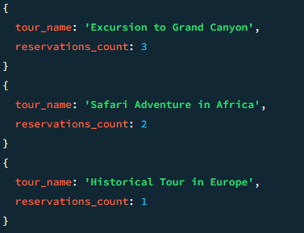

# Dokumentowe bazy danych – MongoDB

---

**Imiona i nazwiska autorów:** Tomasz Furgała, Łukasz Zegar, Konrad Tendaj

--- 


## Yelp Dataset

- [www.yelp.com](http://www.yelp.com) - serwis społecznościowy – informacje o miejscach/lokalach
- restauracje, kluby, hotele itd. `businesses`,
- użytkownicy odwiedzają te miejsca - "meldują się"  `check-in`
- użytkownicy piszą recenzje `reviews` o miejscach/lokalach i wystawiają oceny oceny,
- przykładowy zbiór danych zawiera dane z 5 miast: Phoenix, Las Vegas, Madison, Waterloo i Edinburgh.

# Zadanie 1 - operacje wyszukiwania danych

Dla zbioru Yelp wykonaj następujące zapytania

W niektórych przypadkach może być potrzebne wykorzystanie mechanizmu Aggregation Pipeline

[https://www.mongodb.com/docs/manual/core/aggregation-pipeline/](https://www.mongodb.com/docs/manual/core/aggregation-pipeline/)


1. Zwróć dane wszystkich restauracji (kolekcja `business`, pole `categories` musi zawierać wartość "Restaurants"), które są otwarte w poniedziałki (pole hours) i mają ocenę co najmniej 4 gwiazdki (pole `stars`).  Zapytanie powinno zwracać: nazwę firmy, adres, kategorię, godziny otwarcia i gwiazdki. Posortuj wynik wg nazwy firmy.

2. Ile każda firma otrzymała ocen/wskazówek (kolekcja `tip` ) w 2012. Wynik powinien zawierać nazwę firmy oraz liczbę ocen/wskazówek Wynik posortuj według liczby ocen (`tip`).

3. Recenzje mogą być oceniane przez innych użytkowników jako `cool`, `funny` lub `useful` (kolekcja `review`, pole `votes`, jedna recenzja może mieć kilka głosów w każdej kategorii).  Napisz zapytanie, które zwraca dla każdej z tych kategorii, ile sumarycznie recenzji zostało oznaczonych przez te kategorie (np. recenzja ma kategorię `funny` jeśli co najmniej jedna osoba zagłosowała w ten sposób na daną recenzję)

4. Zwróć dane wszystkich użytkowników (kolekcja `user`), którzy nie mają ani jednego pozytywnego głosu (pole `votes`) z kategorii (`funny` lub `useful`), wynik posortuj alfabetycznie według nazwy użytkownika.

5. Wyznacz, jaką średnia ocenę uzyskała każda firma na podstawie wszystkich recenzji (kolekcja `review`, pole `stars`). Ogranicz do firm, które uzyskały średnią powyżej 3 gwiazdek.

	a) Wynik powinien zawierać id firmy oraz średnią ocenę. Posortuj wynik wg id firmy.

	b) Wynik powinien zawierać nazwę firmy oraz średnią ocenę. Posortuj wynik wg nazwy firmy.

<div style="page-break-after: always"></div>

## Zadanie 1  - rozwiązanie

### 1. 
Zwróć dane wszystkich restauracji (kolekcja `business`, pole `categories` musi zawierać wartość "Restaurants"), które są otwarte w poniedziałki (pole hours) i mają ocenę co najmniej 4 gwiazdki (pole `stars`).  Zapytanie powinno zwracać: nazwę firmy, adres, kategorię, godziny otwarcia i gwiazdki. Posortuj wynik wg nazwy firmy.

```js
db.business.find({
  "categories": "Restaurants",
  "hours.Monday.open": { $exists: true },
  "stars": { $gte: 4 }
}, {
  "name": 1,
  "address": 1,
  "categories": 1,
  "hours.Monday": 1,
  "stars": 1,
  "_id": 0
}).sort({ "name": 1 })
```


### 2.
Ile każda firma otrzymała ocen/wskazówek (kolekcja `tip` ) w 2012. Wynik powinien zawierać nazwę firmy oraz liczbę ocen/wskazówek Wynik posortuj według liczby ocen (`tip`).
```js
db.tip.aggregate([
  {
    $match: {
      date: { $gte: "2012-01-01", $lt: "2013-01-01" }
    }
  },
  {
    $group: {
      _id: "$business_id",
      tipCount: { $sum: 1 }
    }
  },
  {
    $lookup: {
      from: "business",
      localField: "_id",
      foreignField: "business_id",
      as: "business_info"
    }
  },
  {
    $project: {
      _id: 0,
      business_name: { $arrayElemAt: ["$business_info.name", 0] },
      tipCount: 1
    }
  },
  {
    $sort: {
      tipCount: -1
    }
  }
])
```
Ze względu na zbyt duży rozmiar pliku `trip.json`, zaimportowaliśmy tylko część dokumentów w celu przetestowania agragacji.


### 3.
Recenzje mogą być oceniane przez innych użytkowników jako `cool`, `funny` lub `useful` (kolekcja `review`, pole `votes`, jedna recenzja może mieć kilka głosów w każdej kategorii).  Napisz zapytanie, które zwraca dla każdej z tych kategorii, ile sumarycznie recenzji zostało oznaczonych przez te kategorie (np. recenzja ma kategorię `funny` jeśli co najmniej jedna osoba zagłosowała w ten sposób na daną recenzję)
```js
db.review.aggregate([
  {
    $group: {
      _id: null,
      total_funny_reviews: {
        $sum: { $cond: [{ $gt: ["$votes.funny", 0] }, 1, 0] }
      },
      total_useful_reviews: {
        $sum: { $cond: [{ $gt: ["$votes.useful", 0] }, 1, 0] }
      },
      total_cool_reviews: {
        $sum: { $cond: [{ $gt: ["$votes.cool", 0] }, 1, 0] }
      }
    }
  }
])
```
Tutaj również zaimportowaliśmy tylko część dokumentów.


### 4.
Zwróć dane wszystkich użytkowników (kolekcja `user`), którzy nie mają ani jednego pozytywnego głosu (pole `votes`) z kategorii (`funny` lub `useful`), wynik posortuj alfabetycznie według nazwy użytkownika.
```js
db.user.aggregate([
  {
    $match: {
      $or: [
        { "votes.funny": { $eq: 0 } },
        { "votes.useful": { $eq: 0 } }
      ]
    }
  },
  {
    $sort: { "name": 1 }
  }
])
```
Tutaj również zaimportowaliśmy mniej danych


<div style="page-break-after: always"></div>

### 5.
Wyznacz, jaką średnia ocenę uzyskała każda firma na podstawie wszystkich recenzji (kolekcja `review`, pole `stars`). Ogranicz do firm, które uzyskały średnią powyżej 3 gwiazdek.

### 5a
a) Wynik powinien zawierać id firmy oraz średnią ocenę. Posortuj wynik wg. id firmy.


```js
db.review.aggregate([
  {
    $group: {
      _id: "$business_id",
      average_rating: { $avg: "$stars" }
    }
  },
  {
    $match: {
      average_rating: { $gt: 3 }
    }
  },
  {
    $sort: { _id: 1 }
  }
])
```


<div style="page-break-after: always"></div>

### 5b
b) Wynik powinien zawierać nazwę firmy oraz średnią ocenę. Posortuj wynik wg. nazwy firmy.
```js
db.review.aggregate([
  {
    $group: {
      _id: "$business_id",
      average_rating: { $avg: "$stars" }
    }
  },
  {
    $match: {
      average_rating: { $gt: 3 }
    }
  },
  {
    $lookup: {
      from: "business",
      localField: "_id",
      foreignField: "business_id",
      as: "business_info"
    }
  },
  {
    $unwind: "$business_info" 
  },
  {
    $project: {
      _id: 0,
      company_name: "$business_info.name", 
      average_rating: 1
    }
  },
  {
    $sort: { company_name: 1 } 
  }
])

```


---

# Zadanie 2 - modelowanie danych


Zaproponuj strukturę bazy danych dla wybranego/przykładowego zagadnienia/problemu

Należy wybrać jedno zagadnienie/problem (A lub B)

Przykład A
- Wykładowcy, przedmioty, studenci, oceny
	- Wykładowcy prowadzą zajęcia z poszczególnych przedmiotów
	- Studenci uczęszczają na zajęcia
	- Wykładowcy wystawiają oceny studentom
	- Studenci oceniają zajęcia

Przykład B
- Firmy, wycieczki, osoby
	- Firmy organizują wycieczki
	- Osoby rezerwują miejsca/wykupują bilety
	- Osoby oceniają wycieczki

a) Warto zaproponować/rozważyć różne warianty struktury bazy danych i dokumentów w poszczególnych kolekcjach oraz przeprowadzić dyskusję każdego wariantu (wskazać wady i zalety każdego z wariantów)

b) Kolekcje należy wypełnić przykładowymi danymi

c) W kontekście zaprezentowania wad/zalet należy zaprezentować kilka przykładów/zapytań/zadań/operacji oraz dla których dedykowany jest dany wariantów

W sprawozdaniu należy zamieścić przykładowe dokumenty w formacie JSON ( pkt a) i b)), oraz kod zapytań/operacji (pkt c)), wraz z odpowiednim komentarzem opisującym strukturę dokumentów oraz polecenia ilustrujące wykonanie przykładowych operacji na danych

Do sprawozdania należy kompletny zrzut wykonanych/przygotowanych baz danych (taki zrzut można wykonać np. za pomocą poleceń `mongoexport`, `mongdump` …) oraz plik z kodem operacji zapytań (załącznik powinien mieć format zip).


## Zadanie 2  - rozwiązanie

Do realizacji wybraliśmy **problem B**, firmy, wycieczki, osoby.
## a) Różne warianty struktury bazy danych
Rozważamy trzy podejścia w budowaniu struktury bazy danych.

**Pierwsze** składa się z trzech kolekcji: `Firmy`, `Wycieczki` i `Osoby`.
`Firmy` to kolekcja, która zawiera dane o firmach organizujących wycieczki. Kolekcja `Wycieczki` zawiera informacje o wycieczkach, w tym nazwę, opis, datę, cenę, firmę organizującą, oceny. `Osoby` zawiera informacje o osobach rezerwujących miejsca oraz oceniających wycieczki.

Zalety: 
- posiadanie danych w jednej kolekcji może sprawić, że struktura bazy danych będzie prostsza i łatwiejsza do zrozumienia,
- operacje takie jak indeksowanie, wyszukiwanie i modyfikacja danych mogą być łatwiejsze do przeprowadzenia.

Wady:
- utrudniona aktualizacja/dodanie danych,
- prowadzi do powielania danych,
- może być trudne do skalowania, gdy baza danych rośnie wraz z liczbą firm, wycieczek i osób.

**Drugie** składa się z czterech kolekcji: `Firmy`, `Wycieczki`, `Osoby` i `Rezerwacje`.
Kolekcje `Firmy`, `Wycieczki`, `Osoby` będą pełniły taką samą role jak w podejściu pierwszym. Natomiast kolekcja `Rezerwacje` będzie zawierać informacje o zapisie danej osoby na wycieczkę.

Zalety:
- minimalizacjia powielania danych,
- ułatwiona aktualizacja danych,
- lepsza skalowalność,
- łatwiejszy dostęp rezerwacji.

Wady:
- zapytania są bardziej skomplikowane, złożone - koniecznośc agregacji w wielu przypadkach, 
- duża liczba referencji może spowodować spadek wydajności.


**Trzecie** składa się z dwóch kolekcji: `Osoby` i `Firmy`
Kolekcja `Osoby` będzie zawierać dane o użytkownikach, natomiast kolekcja `Firmy` będzie zawierać dane dotyczące firm, a także zagnieżdżone dane o oferowanych wycieczkach i osobach zapisanych na wycieczki.

Zalety:
- większość danych jest przechowywanych w jednej kolekcji,
- mniejsza liczba kolekcji oznacza prostszą strukturę danych, co może ułatwić zarządzanie i zrozumienie bazy danych,
- mniej operacji łączenia danych podczas przetwarzania danych - możliwość pozyskania istonych danych z jednej kolekcji przy uzyciu prostego polecenia find().

Wady:
- słaba skalowaność,
- ryzyko niespójności danych,
- trudności w zapewnieniu spójności danych.

### Struktura kolekcji:

#### Companies:
```json
{
  "company_id": "indetyfikator",
  "company_name": "Nazwa firmy"
}
```
<div style="page-break-after: always"></div>

#### Persons:
```json
{
  "user_id": "indetyfikator",
  "name": "Name of the person"
}
```
### Wariant 1:

#### Tours
```json
{
  "tour_id": "indetyfikator",
  "tour_name":  "nazwa wycieczki",
  "date": "data",
  "price": "Cena",
  "company_id": "indetyfikator firmy",
  "ratings": [
    {
      "user_id": "identyfikator osoby",
      "rating": "ocena"
    },
  ],
  "reservations": [
    {
      "user_id": "identyfikator osoby",
      "date": "data rezerwacji"
    },
  ]
}
```

### Wariant 2:

#### Tours
```json
{
  "tour_id": "indetyfikator",
  "tour_name":  "nazwa wycieczki",
  "date": "data",
  "price": "Cena",
  "company_id": "indetyfikator firmy",
  "ratings": [
    {
      "user_id": "identyfikator osoby",
      "rating": "ocena"
    }
  ]
}
```

#### Reservations
```json
{
  "reservation_id": "indetyfikator",
  "tour_id": "indetyfikator wycieczki",
  "user_id": "identyfikator osoby",
  "date": "data rezerwacji"
}
```

### Wariant 3:

#### Companies
```json
{
  "company_id": "indetyfikator",
  "company_name": "Nazwa firmy",
  "tours": [
    {
      "tour_name":  "nazwa wycieczki",
      "date": "data",
      "price": "Cena",
      "ratings": [
        {
          "user_id": "identyfikator osoby",
          "rating": "ocena"
        }
      ],
      "reservations": [
        {
          "user_id": "identyfikator osoby",
          "date": "data rezerwacji"
        },
      ]
    }
  ]
}
```


W celu przetestowania wszystkich wariantów stworzyliśmy 3 bazy.

## b)

Przykładowe dane dla kolekcji `Companies` i `Persons`:
```js
db.companies.insertMany([
  { company_id: "1", company_name: "Adventure Excursions Inc." },
  { company_id: "2", company_name: "Exploration Tours Ltd." },
  { company_id: "3", company_name: "Discover Destinations LLC" }
]);

db.persons.insertMany([
  { user_id: "101", name: "John Smith" },
  { user_id: "102", name: "Emily Johnson" },
  { user_id: "103", name: "Michael Brown" },
  { user_id: "104", name: "Jessica Davis" },
  { user_id: "105", name: "Christopher Wilson" },
  { user_id: "106", name: "Amanda Martinez" },
  { user_id: "107", name: "David Anderson" },
  { user_id: "108", name: "Jennifer Taylor" },
  { user_id: "109", name: "Daniel Thomas" },
  { user_id: "110", name: "Linda Garcia" }
]);
```
<div style="page-break-after: always"></div>

### Wariant 1:

```js
db.tours.insertMany([
  {
    "tour_id": "1",
    "tour_name": "Excursion to Grand Canyon",
    "date": "2024-05-15",
    "price": 150,
    "company_id": "1",
    "ratings": [
      { "user_id": "105", "rating": 5 }
    ],
    "reservations": [
      { "user_id": "101", "date": "2024-05-10" },
      { "user_id": "105", "date": "2024-05-14" }
    ]
  },
  {
    "tour_id": "2",
    "tour_name": "Safari Adventure in Africa",
    "date": "2024-06-20",
    "price": 300,
    "company_id": "2",
    "ratings": [
      { "user_id": "106", "rating": 5 },
      { "user_id": "109", "rating": 5 }
    ],
    "reservations": [
      { "user_id": "108", "date": "2024-06-12" },
      { "user_id": "109", "date": "2024-06-14" }
    ]
  },
  {
    "tour_id": "3",
    "tour_name": "Historical Tour in Europe",
    "date": "2024-07-25",
    "price": 200,
    "company_id": "3",
    "ratings": [
      { "user_id": "106", "rating": 4 }
    ],
    "reservations": [
      { "user_id": "106", "date": "2024-07-24" }
    ]
  }
]);
```

### Wariant 2:

```js
db.tours.insertMany([
  {
    "tour_id": "1",
    "tour_name": "Excursion to Grand Canyon",
    "date": "2024-05-15",
    "price": 150,
    "company_id": "1",
    "ratings": [
      { "user_id": "105", "rating": 5 }
    ]
  },
  {
    "tour_id": "2",
    "tour_name": "Safari Adventure in Africa",
    "date": "2024-06-20",
    "price": 300,
    "company_id": "2",
    "ratings": [
      { "user_id": "106", "rating": 5 },
      { "user_id": "109", "rating": 5 }
    ]
  },
  {
    "tour_id": "3",
    "tour_name": "Historical Tour in Europe",
    "date": "2024-07-25",
    "price": 200,
    "company_id": "3",
    "ratings": [
      { "user_id": "106", "rating": 4 }
    ]
  }
]);
```

```js
db.reservations.insertMany([
  {
    "reservation_id": "1",
    "tour_id": "1",
    "user_id": "101", 
    "date": "2024-05-10" 
  },
  {
    "reservation_id": "2",
    "tour_id": "1",
    "user_id": "105", 
    "date": "2024-05-14" 
  },
  {
    "reservation_id": "3",
    "tour_id": "2",
    "user_id": "108", 
    "date": "2024-06-12"
  },
  {
    "reservation_id": "4",
    "tour_id": "2",
    "user_id": "109", 
    "date": "2024-06-14" 
  },
  {
    "reservation_id": "5",
    "tour_id": "3",
    "user_id": "106", 
    "date": "2024-07-24"
  }
]);
```

<div style="page-break-after: always"></div>

### Wariant 3:

```js
db.companies.insertMany([
  { 
    company_id: "1", 
    company_name: "Adventure Excursions Inc.",
    tours: [
      {
        "tour_name": "Excursion to Grand Canyon",
        "date": "2024-05-15",
        "price": 150,
        "ratings": [
          { "user_id": "105", "rating": 5 }
        ],
        "reservations": [
          { "user_id": "101", "date": "2024-05-10" },
          { "user_id": "105", "date": "2024-05-14" }
        ]
      }
    ]
  },

  { 
    company_id: "2", 
    company_name: "Exploration Tours Ltd.",
    tours: [
      {
        "tour_name": "Safari Adventure in Africa",
        "date": "2024-06-20",
        "price": 300,
        "ratings": [
          { "user_id": "106", "rating": 5 },
          { "user_id": "109", "rating": 5 }
        ],
        "reservations": [
          { "user_id": "108", "date": "2024-06-12" },
          { "user_id": "109", "date": "2024-06-14" }
        ]
      }
    ]
  },

  { 
    company_id: "3", 
    company_name: "Discover Destinations LLC",
    tours: [
      {
        "tour_name": "Historical Tour in Europe",
        "date": "2024-07-25",
        "price": 200,
        "ratings": [
          { "user_id": "106", "rating": 4 }
        ],
        "reservations": [
          { "user_id": "106", "date": "2024-07-24" }
        ]
      }
    ]
  }
]);
```
<div style="page-break-after: always"></div>

## c)

### Polecenie wyświetlające listę wycieczek, na które zapisana jest dana osoba:

#### Wariant 1:
```js
db.tours.aggregate([
  { 
    $unwind: "$reservations" 
  },
  {
    $match: {
      "reservations.user_id": "101"
    }
  },
  {
    $lookup: {
      from: "companies",
      localField: "company_id",
      foreignField: "company_id",
      as: "company"
    }
  },
  {
    $unwind: "$company"
  },
  {
    $lookup: {
      from: "persons",
      localField: "reservations.user_id",
      foreignField: "user_id",
      as: "user"
    }
  },
  {
    $unwind: "$user"
  },
  {
    $project: {
      "_id": 0,
      "user_name": "$user.name",
      "tour_id": 1,
      "tour_name": 1,
      "date": 1,
      "price": 1,
      "company_name": "$company.company_name",
      "reservation_date": "$reservations.date"
    }
  }
])
```


<div style="page-break-after: always"></div>

#### Wariant 2:

```js
db.reservations.aggregate([
  {
    $match: {
      user_id: "101" 
    }
  },
  {
    $lookup: {
      from: "tours",
      localField: "tour_id",
      foreignField: "tour_id",
      as: "tour_info"
    }
  },
  {
    $unwind: "$tour_info" 
  },
  {
    $lookup: {
      from: "persons",
      localField: "user_id",
      foreignField: "user_id",
      as: "user_info"
    }
  },
  {
    $lookup: {
      from: "companies",
      localField: "tour_info.company_id",
      foreignField: "company_id",
      as: "company_info"
    }
  },
  {
    $unwind: "$user_info" 
  },
  {
    $unwind: "$company_info" 
  },
  {
    $project: {
      _id: 0,
      tour_id: "$tour_info.tour_id",
      tour_name: "$tour_info.tour_name",
      date: "$tour_info.date",
      price: "$tour_info.price",
      user_name: "$user_info.name",
      company_name: "$company_info.company_name",
      reservation_date: "$date"
    }
  }
])
```


#### Wariant 3:
```js
db.companies.aggregate([
  {
    $unwind: "$tours"
  },
  {
    $unwind: "$tours.reservations" 
  },
  {
    $match: {
      "tours.reservations.user_id": "101" 
    }
  },
  {
    $lookup: {
      from: "persons",
      localField: "tours.reservations.user_id",
      foreignField: "user_id",
      as: "user"
    }
  },
  {
    $project: {
      _id: 0,
      tour_name: "$tours.tour_name",
      company_name: "$company_name",
      date: "$tours.date",
      price: "$tours.price",
      user_name: { $arrayElemAt: ["$user.name", 0] }, 
      reservation_date: "$tours.reservations.date" 
    }
  }
]);
```


<div style="page-break-after: always"></div>

### Polecenie wyświetlające wycieczki, które posiadają co najmniej jedną ocenę równą 5. Wynik sortuje alfabetycznie po nazwie wycieczek:

#### Wariant 1:
```js
db.tours.aggregate([
  {
    $match: {
      "ratings.rating": { $gte: 5 } 
    }
  },
  {
    $project: {
      "_id": 0,
      "tour_name": 1,
      "num_of_5_ratings": {
        $size: { 
          $filter: {
            input: "$ratings",
            as: "rating",
            cond: { $eq: ["$$rating.rating", 5] }
          }
        }
      }
    }
  }
])
```


#### Wariant 2:
```js
db.tours.aggregate([
  {
    $match: {
      "ratings.rating": 5 
    }
  },
  {
    $project: {
      _id: 0,
      tour_name: 1,
      num_ratings_5: {
        $size: {
          $filter: {
            input: "$ratings",
            as: "rating",
            cond: { $eq: ["$$rating.rating", 5] }
          }
        }
      }
    }
  },
  {
    $sort: {
      tour_name: 1 
    }
  }
])
```


#### Wariant 3:
```js
db.companies.aggregate([
  {
    $unwind: "$tours" 
  },
  {
    $unwind: {
      path: "$tours.ratings",
      preserveNullAndEmptyArrays: true
    } // Rozwijamy tablicę ocen w ramach wycieczki
  },
  {
    $match: {
      "tours.ratings.rating": { $eq: 5 } 
    }
  },
  {
    $group: {
      _id: "$tours.tour_name",
      count: { $sum: 1 } 
    }
  },
  {
    $sort: {
      tour_name: 1 
    }
  },
  {
    $project: {
      _id: 0,
      tour_name: "$_id",
      count_of_5_ratings: "$count"
    }
  }
]);
```


### Polecenie wyświetlające nazwę wycieczek wraz z liczbą rezerwacji:

#### Wariant 1:
```js
db.tours.find(
  {}, 
  { 
    _id: 0, 
    tour_name: 1, 
    reservations_count: { $size: "$reservations" } 
  }
)
```


#### Wariant 2:
```js
db.tours.aggregate([
  {
    $lookup: {
      from: "reservations",
      localField: "tour_id",
      foreignField: "tour_id",
      as: "reservations"
    }
  },
  {
    $project: {
      _id: 0,
      tour_name: 1,
      num_reservations: { $size: "$reservations" }
    }
  }
])
```


#### Wariant 3:
```js
db.companies.aggregate([
  {
    $unwind: "$tours" 
  },
  {
    $project: {
      "_id": 0,
      "tour_name": "$tours.tour_name",
      "reservations_count": { $size: "$tours.reservations" }
    }
  }
])
```


<div style="page-break-after: always"></div>

### Wnioski:
Jak widzimy na przykładzie agregacji, w wariancie 3 zapytania wydają się mniej skomplikowane i odrobinę prostsze ze względu na przechowywanie większości danych w jednej kolekcji.


### Dodanie nowej rezerwacji:

#### Wariant 1:

```js
db.tours.updateOne(
  { 
    "tour_id": "1"
  },
  {
    $addToSet: {
      "reservations": { "user_id": "103", "date": "2024-05-11" }
    }
  }
);
```

#### Wariant 2:
```js
db.reservations.insertOne({
  "reservation_id": "6",
  "tour_id": "1",
  "user_id": "103", 
  "date": "2024-05-11" 
});
```

#### Wariant 3:
```js
db.companies.updateOne(
  { "company_id": "1" }, // Dopasowujemy firmę pierwszą
  {
    $push: {
      "tours.$[tour].reservations": { "user_id": "103", "date": "2024-05-11" }
    }
  },
  {
    arrayFilters: [{ "tour.tour_name": "Excursion to Grand Canyon" }] 
  }
);
```

### Dodanie nowej oceny:

#### Wariant 1:

```js
db.tours.updateOne(
  { "tour_id": "1" },
  { 
    $push: { 
      "ratings": {
        "user_id": "106",
        "rating": 3
      } 
    } 
  }
);

```

#### Wariant 2:

```js
db.tours.updateOne(
  { "tour_id": "1" },
  { 
    $push: { 
      "ratings": { 
        "user_id": "106",
        "rating": 3 
      } 
    } 
  }
)
```

#### Wariant 3:
```js
db.companies.updateOne(
  { "company_id": "1", "tours.tour_name": "Excursion to Grand Canyon" },
  {
    $push: {
      "tours.$.ratings": { "user_id": "106", "rating": 3 }
    }
  }
);
```

### Wnioski:
Dodawanie danych, w każdym z wariantów wydaje się być skomplikowane na tym samym poziomie, choć w drugim wariancie jest to bardziej intuicyjne.

### Usunięcie rezerwacji na wycieczkę:

#### Wariant 1:
```js
db.tours.updateOne(
  { 
    "tour_id": "1", 
    "reservations.user_id": "103" 
  },
  {
    $pull: { 
      "reservations": {
        "user_id": "103"
      }
    }
  }
)
```

#### Wariant 2:
```js
db.reservations.deleteOne({
  user_id: "103",
  tour_id: "1"
})
```

#### Wariant 3:
```js
db.companies.updateOne(
  { 
    "company_id": "1",
    "tours.tour_name": "Excursion to Grand Canyon",
  },
  { 
    $pull: { 
      "tours.$.reservations": { "user_id": "103" } 
    } 
  }
);

```

### Wnioski:

Dużo łatwiej jest usuwać dane z osobnych kolekcji, niż w strukturach zagnieżdżonych. W wariancie 2 wystarczyło proste polecienie `deleteOne`, natomiast w pozostałych musieliśmy użyć `updateOne` oraz operatora `pull`. Operacja usuwania danych z zagnieżdżonych struktur jest bardziej złożona, ponieważ wymaga odnalezienia odpowiedniego zagnieżdżonego elementu i jego aktualizacji lub usunięcia. 


## Wnioski ogólne:

- Każdy z przedstawionych przez nas wariantów ma swoje zalety oraz wady, a wybór pomiędzy nimi zależy od wielu czynników, takich jak rodzaj danych, skala aplikacji oraz wymagania dotyczące wydajności i skalowalności. Zauważamy, że operacje dodawania, usuwania czy aktualizacji danych w strukturach zagnieżdżonych są bardziej skomplikowane niż klasyczne operacje na podstawowych typach danych. Natomiast pozyskiwanie danych w takich rozwiązaniach jest prostsze ze względu na fakt posiadania wielu danych w jednej kolekcji. W rozwiązaniu opierającym się na tworzeniu wielu kolekcji, tworzenie zapytań w celu uzyskania danych może być bardziej skomplikowane i wymagać użycia agregacji.
- Bezpieczeństwo danych jest kluczowym aspektem każdej struktury bazy danych. Warto rozważyć, jak każdy z proponowanych wariantów wpływa na bezpieczeństwo danych, w tym dostęp do nich, poufność, integralność i dostępność. W przypadku rozdzielenia danych między różne kolekcje lub bazodanowe, należy szczególnie zwrócić uwagę na mechanizmy kontroli dostępu oraz procedury zapobiegania utracie danych lub naruszeniom zabezpieczeń. Warianty zagnieżdżone mogą również wymagać dodatkowych mechanizmów zapewnienia spójności danych oraz ochrony przed atakami zewnętrznymi czy wewnętrznymi.
- Warto uwzględnić zgodność proponowanych struktur bazy danych z praktykami branżowymi. W niektórych sektorach istnieją specyficzne normy dotyczące struktury i zarządzania danymi, które mogą wpłynąć na wybór optymalnej konfiguracji bazy danych. Analiza, czy dany wariant jest zgodny z takimi standardami, może pomóc w uniknięciu niezgodności w przyszłości oraz ułatwić integrację z istniejącymi systemami lub usługami.
---

Punktacja:
|         |     |
| ------- | --- |
| zadanie | pkt |
| 1       | 0,6 |
| 2       | 1,4 |
| razem   | 2   |
