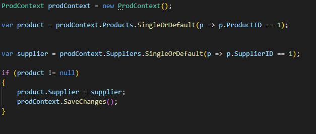
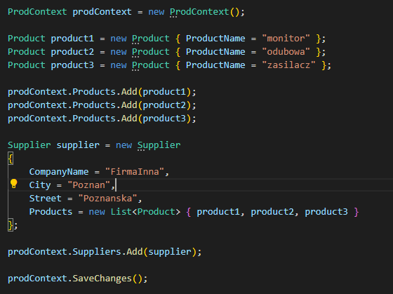
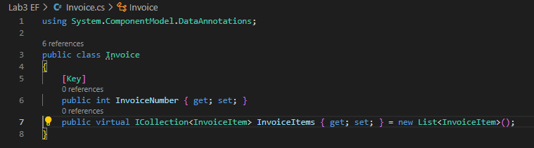
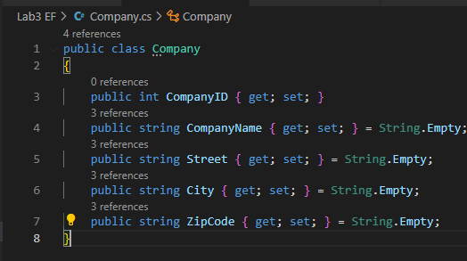

# Entity Framework

---

Imiona i nazwiska autorów: **Tomasz Furgała**

## Część I

Udało się zrealizować wszystko zgodnie z tym co było w instrukcji.

#### Widok projektu

#### DbContext

#### Product

#### Program.cs

#### Wykonanie Program.cs

#### Wyświetlenie bazy przy pomocy sqlite3

## Część II

### a. Relacja Suppliers -> Products

Stworzenie nowej klasy Supplier

Dodanie zbioru Suppliers do ProdContext

Dodanie pola Supplier do klasy Product

Stworzenie nowego dostawcy - Program.cs

udało się dodać nowego dostawcę

Dodanie do istniejącego już produktu stworzonego przed chwilą dostawcę:

I teraz produkt z ProduktID == 1 ma przypisanego dostawce. Dostawca jest przypisany przez SupplierID.

Diagram wygląda następująco:

### b. Odwrócenie relacji

Dodanie listy do przechowywania produktów w supplierze

Klasa product:

Program.cs - stworzenie nowych produktów i dodanie ich do listy nowego dostawcy

Udało się dodać zarówno produkty jak i dostawce.

Jak możemy zauważyć, pomimo zapisania relacji w Entity Frameworku w odwrotny sposób, w bazie danych relacja wciąż wygląda tak samo.Widzimy więc, że Entity Framework „pod spodem” dokonał optymalizacji, dzięki czemu nie musimy trzymać w tabeli `Suppliers` powielonych danych dostawców, różniących się jedynie `SupplierID` oraz kluczem obcym, wskazującym na produkt z tabeli `Products`.

### c. Relacja dwustronna

Połączenie dwóch poprzednich podejść. Klasa Suppliers posiada pole z listą produktów, natomiast Products posida pole przechowujące obiekt dostawcy (w rzeczywistości SupplierID).

**Program.cs - stworzenie nowych produktów i nowego dostawce, i połacenie ze sobą obiektów**

Stworzyłem kilka produktów i nowego dostawce. Dodałem produkty do listy produktów należącej do utworzonego dostawcy i na koniec dodałem do każdego z produktów dostawce.

Ponownie obserwujemy taki sam diagram. Możemy więc dojść do wniosku, że Entity Framework pozwala nam na stworzenie relacji dwukierunkowej (lub w odwrotnym kierunku do tego, w którym relacja zostanie zapisana, jak widzieliśmy w poprzednim przykładzie), po to, aby łatwiej móc manipulować powiązanymi ze sobą obiektami.

### d. Relacja wiele do wielu

Klasy `Products` i `Invoices` będą zawierały listy odpowiednio faktur i produktów. Do zamodelowania takiej relacji będziemy potrzebowali tebeli pomocniczej `InvoicItems`.

**Klasa Product**

**Klasa Invoice**

**Klasa InvoiceItem - Klasa pomocnicza, reprezentująca pozycje faktury**

**prodContext**

**Program.cs**

Stworzyłem nowe produkty, które później dodaje do słownika gdzie przechowuje ilość zakupionych produktów. Następnie dodaje produkty do listy w `InvoiceItem`. Tworzę faktury zawierające obiekty `InvoiceItem`.

**Diagram**

### e. Table-Per-Hierarchy

**Klasa Company**

**Supplier**

**Customer**

**CompContext**

**Program.cs - dodanie klientów i dostawców**

**Wynik**

Otrzymujemy tylko 1 tabele zawierającą zarówno pola zdefiniowane w klasie Customers jak i Suppliers. 

### f. Table-Per-Type

**Klasa Company**

**Supplier**

**Customer**
 

**CompContext**

**Program.cs - dodanie klientów i dostawców**

**Diagram**

Otrzymujemy tylko 3 tabele. Tabele `Customers` i `Suppliers` są połączone z `Companies` za pomocą po `CompanyID`. 

**Companies**

**Suppliers**

**Customers**

### g. Porównanie

#### Table-Per-Hierarchy

Tworzona jest jedna tabela, która zawiera wspólne dla klas dziedziczących dane oraz dane, charakteryzujące każdą z klas dziedziczących z osobna. W przypadku, gdy klasa dziedzicząca posiada atrybut, którego nie ma w klasie, z której dziedziczy, dodawana jest osobna kolumna, w której dla pozostałych klas wpisane są wartości null, a dla tej klasy, odpowiednie wartości tego parametru.

**Zalety**

* Prostsze i bardziej wydajne zapytania: TPH używa jednej tabeli dla wszystkich klas dziedziczących, co oznacza, że zapytania są prostsze i łatwiejsze do wykonania (nie wymagają klauzuli join).
* Mniejsza liczba tabel: TPH wymaga tylko jednej tabeli, co prowadzi do mniejszej liczby tabel w bazie danych.
* Łatwiejsze mapowanie: Mniej konfiguracji jest wymagane, ponieważ wszystkie klasy dziedziczące mapowane są do jednej tabeli.

**Wady**

* W przypadku wielu klas dziedziczących z tej samej klasy, jedna tabela nie jest dobrym rozwiązaniem, ponieważ będzie zawierała bardzo dużo wartości null (marnowanie miejsca),
* Grupowanie danych, w przypadku wielu klas dziedziczących, zmniejsza przejrzystość schematu bazy danych.

#### Table-Per-Type

Tworzone jest kilka tabel (osobne tabele dla każdej z klas, zarówno tej, z której dziedziczą klasy, jak i klas dziedziczących). Tabele klas dziedziczących są łączone z tabelą klasy, z której dziedziczą. przy pomocy relacji 1 do 1.

**Zalety**

* Normalizacja danych: Każda klasa dziedzicząca mapowana jest do osobnej tabeli, co prowadzi do bardziej znormalizowanej struktury danych.
* Bardziej zrozumiały digram bazy danych, gdzie widzimy jak klasy dziedziczą po innych klasach.
* Takie podejście nie wymaga trzymania pustych wartości w tabelach (null), dzięki czemu zapisywane są tylko wartości.

**Wady**

* Konieczne jest wykonywanie wielu operacji join (łączenie tabel klas dziedziczących z tabelą klasy nadrzędnej – tej, z której klasy dziedziczą).

Osobiście bedziej podobała mi się strategia Table-Per-Type ze względu na bardziej zrozumiałą i naturalną strukture