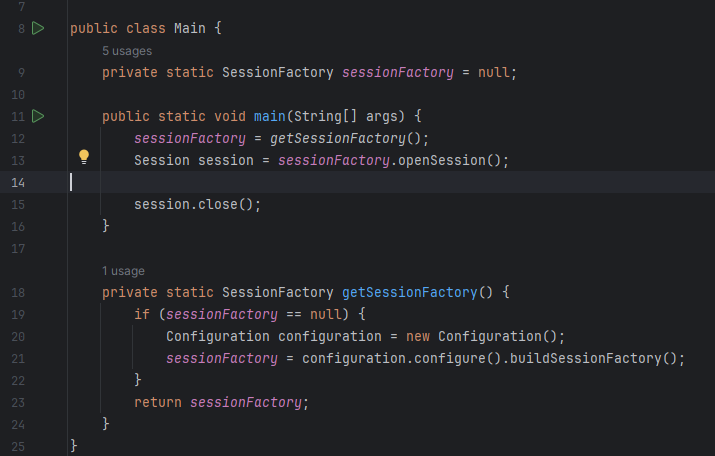
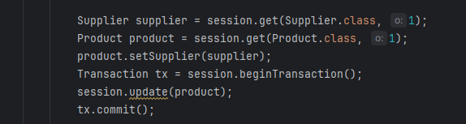
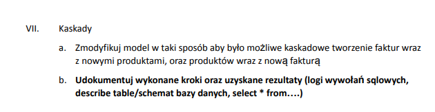
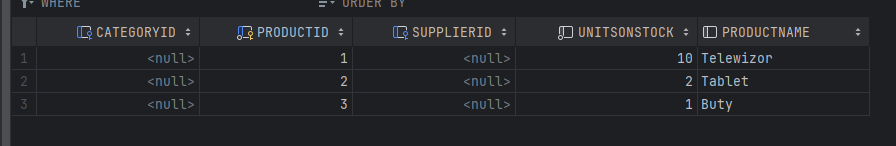
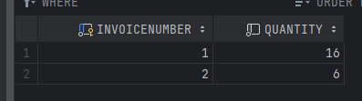
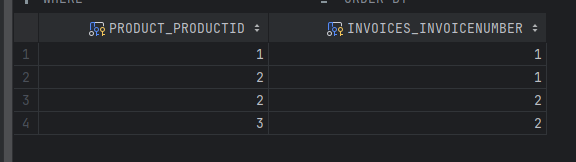

# Hibernate/JPA

---

Imiona i nazwiska autorów: **Tomasz Furgała**

## Część I

Uruchomienie serwera Derby:


Plik pom.xml


Oraz udało się pomyślnie zainstalować wszystkie zależności


Plik konfiguracyjny


Plik Main



I udało się połączyć z bazą danych


Stworzyłem klasę Product i spróbuje dodać coś do bazy


Po uruchomieniu Maina, nowy produkt "Rower" pojawił się w bazie danych


## Część II

### zad 1 - Dodanie dostawcy


Na pocztek stworzyłem klasę Supplier


oraz dodałem nowego dostawce


Następnie stworzyłem relacje w tabeli Product oraz dodałeg settera by móc ustwić dostawcę dla isniejącego już produktu


W Mainie pobrałem obiekty istniejącego dostawcy i produktu, a następnie ustawiłem dostawcę dla produktu




diagram


### zad 2 - Odwrócenie relacji


#### z tabelą łącznikową

W klasie Product zakomentowałem pole SupplierID i wszyskie miejsca w kodzie z nim związane:


W klasie Supplier dodaje polę z kolekcją zawierającą produkty


dodałem kilka nowych produktów


tworzę nowego dostawcę i dodaję do niego przed chwilą utworzone produkty


powstała nowa tabela


i tak się prezentują dane


diagram


#### bez tabeli łącznikowej

Klasa Product pozostaje bez zmian

Natomiast klasa Supplier - dodaję adnotacje @JoinColumn


Wyczyściłem baze danych i dodałem te same produkty co wcześniej:


Stworzyłem dostawce i dodałem do jego listy produkty:


I oto efekt


Diagram:


### zad 3 - Relacja dwustronna


Klasa Supplier:
```java
@Entity
public class Supplier {

    @Id
    @GeneratedValue(strategy = GenerationType.AUTO)
    private int supplierID;
    private String companyName;
    private String street;
    private String city;
    @OneToMany(mappedBy = "supplier")
    private List<Product> products = new ArrayList<>();

    public Supplier() {}
    public Supplier(String companyName, String street, String city) {
        this.companyName = companyName;
        this.street = street;
        this.city = city;
    }

    @Override
    public String toString() {
        return "Supplier{" +
                "supplierID=" + supplierID +
                ", companyName='" + companyName + '\'' +
                ", street='" + street + '\'' +
                ", city='" + city + '\'' +
                '}';
    }

    public void addProduct(Product product) {
        products.add(product);
    }
}
```

Klasa Product:
```java
@Entity
public class Product {

    @Id
    @GeneratedValue(strategy = GenerationType.AUTO)
    private int productID;
    private String productName;
    private int unitsOnStock;
    @ManyToOne
    @JoinColumn(name = "supplierID")
    private Supplier supplier;


    public Product() {

    }

    public Product(String productName, int unitsOnStock) {
        this.productName = productName;
        this.unitsOnStock = unitsOnStock;
    }

    public Product(String productName, int unitsOnStock, Supplier supplier) {
        this.productName = productName;
        this.unitsOnStock = unitsOnStock;
        this.supplier = supplier;
    }

    @Override
    public String toString() {
        return "Product{" +
                "productID=" + productID +
                ", productName='" + productName + '\'' +
                ", unitsOnStock=" + unitsOnStock +
                ", supplier=" + supplier +
                '}';
    }

    public void setSupplier(Supplier supplier) {
        this.supplier = supplier;
    }

    public Supplier getSupplier() {
        return supplier;
    }
}
```

Ponownie usuwam dane z tabel i dodaje nowe produkty i dostawców:
```java
public static void main(String[] args) {
    sessionFactory = getSessionFactory();
    Session session = sessionFactory.openSession();


    Transaction tx = session.beginTransaction();

    Product product1 = new Product("trampki", 5);
    Product product2 = new Product("piłka", 10);
    Product product3 = new Product("monitor", 3);

    Supplier supplier1 = new Supplier("Firma1", "krakowska", "Poznań");
    Supplier supplier2 = new Supplier("Firma2", "warszawaska", "Kraków");
    product1.setSupplier(supplier1);
    product3.setSupplier(supplier1);
    product2.setSupplier(supplier2);

    supplier1.addProduct(product1);
    supplier1.addProduct(product3);
    supplier2.addProduct(product2);


    session.save(product1);
    session.save(product2);
    session.save(product3);
    session.save(supplier1);
    session.save(supplier2);
    tx.commit();

    session.close();
}
```

Efekt w tabelach:


Diagram:


### zad 4 - Dodanie Category


Dodaje nową klasę `Category`:
```java
@Entity
@Table(name = "Categories")
public class Category {
    @Id
    @GeneratedValue(strategy = GenerationType.AUTO)
    private int categoryID;
    private String name;

    @OneToMany(mappedBy = "category")
    private List<Product> products = new ArrayList<>();

    public Category() {
    }

    public Category(String name) {
        this.name = name;
    }

    @Override
    public String toString() {
        return name;
    }

    public List<Product> getProducts() {
        return products;
    }

    public void addProduct(Product product) {
        products.add(product);
    }
}
```

Dodaje nowe pole do klasy `Product`:
```java
public class Product {

    @Id
    @GeneratedValue(strategy = GenerationType.AUTO)
    private int productID;
    private String productName;
    private int unitsOnStock;
    @ManyToOne
    @JoinColumn(name = "supplierID")
    private Supplier supplier;

    @ManyToOne
    @JoinColumn(name = "categoryID")
    private Category category;

    public Product() {

    }

    public Product(String productName, int unitsOnStock) {
        this.productName = productName;
        this.unitsOnStock = unitsOnStock;
    }

    public Product(String productName, int unitsOnStock, Supplier supplier) {
        this.productName = productName;
        this.unitsOnStock = unitsOnStock;
        this.supplier = supplier;
    }

    @Override
    public String toString() {
        return "Product{" +
                "productID=" + productID +
                ", productName='" + productName + '\'' +
                ", unitsOnStock=" + unitsOnStock +
                ", supplier=" + supplier +
                '}';
    }

    public void setSupplier(Supplier supplier) {
        this.supplier = supplier;
    }

    public Supplier getSupplier() {
        return supplier;
    }

    public void setCategory(Category category) {
        this.category = category;
    }
    public Category getCategory() {
        return category;
    }
}
```

Klasa `Supplier` pozostaje bez zmian (jest takie sama jak w poprzednim podpunkcie)

Dodałem do bazy kilka produktów i kategorii:

```java
public static void main(String[] args) {
    sessionFactory = getSessionFactory();
    Session session = sessionFactory.openSession();

    Transaction tx = session.beginTransaction();

    Product product1 = new Product("laptop", 1);
    Product product2 = new Product("myszka", 11);
    Product product3 = new Product("trzewiki", 30);

    Category category1 = new Category("Elektornika");
    Category category2 = new Category("Obuwie");

    category1.addProduct(product1);
    category1.addProduct(product2);
    category2.addProduct(product3);

    product1.setCategory(category1);
    product2.setCategory(category1);
    product3.setCategory(category2);

    session.save(product1);
    session.save(product2);
    session.save(product3);
    session.save(category1);
    session.save(category2);

    tx.commit();

    session.close();
}
```

I tak się prezentują dane: (produkty w kolumnie SuplierID mają wartości `NULL` bo tworzyłem nowe obiekty i nie ustawiałem im dostawcy)


Spróbuję teraz wydobyć dane:
```java
public static void main(String[] args) {
    sessionFactory = getSessionFactory();
    Session session = sessionFactory.openSession();

    Transaction tx = session.beginTransaction();

    Category category = session.get(Category.class, 1);
    List<Product> products = category.getProducts();
    System.out.println("Produkty nalezace do kategorii: " + category);
    for (Product product: products) {
        System.out.println(product);
    }

    System.out.println();
    Product prod = session.get(Product.class, 1);
    System.out.println(prod + " nalezy do kategorii: " + prod.getCategory());

    tx.commit();

    session.close();
}
```


### zad 5 - Relacja wiele do wielu


Dodałem klasę `Invoice`
```java
@Entity
public class Invoice {
    @Id
    @GeneratedValue(strategy = GenerationType.AUTO)
    private int invoiceNumber;
    private int quantity = 0;

    @ManyToMany
    @JoinTable(
        name = "invoice_product",
        joinColumns = @JoinColumn(name = "invoice_id"),
        inverseJoinColumns = @JoinColumn(name = "product_id")
    )
    private Set<Product> products = new HashSet<>();

    public Invoice() {}

    @Override
    public String toString() {
        return String.valueOf(invoiceNumber);
    }

    public void addProduct(Product product, int quantity) {
        this.products.add(product);
        this.quantity += quantity;
    }

    public int getInvoiceNumber() {
        return invoiceNumber;
    }

    public int getQuantity() {
        return quantity;
    }

    public Set<Product> getProducts() {
        return products;
    }

}
```

I dodaję pole @ManyToMany w o klasie `Product`
```java
@Entity
public class Product {

    @Id
    @GeneratedValue(strategy = GenerationType.AUTO)
    private int productID;
    private String productName;
    private int unitsOnStock;
    @ManyToOne
    @JoinColumn(name = "supplierID")
    private Supplier supplier;

    @ManyToOne
    @JoinColumn(name = "categoryID")
    private Category category;
    @ManyToMany(mappedBy = "products")
    private Set<Invoice> invoices = new HashSet<>();

    public Product() {
    }

    public Product(String productName, int unitsOnStock) {
        this.productName = productName;
        this.unitsOnStock = unitsOnStock;
    }

    public Product(String productName, int unitsOnStock, Supplier supplier) {
        this.productName = productName;
        this.unitsOnStock = unitsOnStock;
        this.supplier = supplier;
    }

    @Override
    public String toString() {
        return "Product{" +
                "productID=" + productID +
                ", productName='" + productName + '\'' +
                ", unitsOnStock=" + unitsOnStock +
                ", supplier=" + supplier +
                '}';
    }

    public void setSupplier(Supplier supplier) {
        this.supplier = supplier;
    }

    public Supplier getSupplier() {
        return supplier;
    }

    public void setCategory(Category category) {
        this.category = category;
    }
    public Category getCategory() {
        return category;
    }

    public Set<Invoice> getInvoices() {
        return invoices;
    }


    public void sell(Invoice invoice, int quantity) throws InvalidAttributeValueException {
        if (unitsOnStock < quantity) {
            throw new InvalidAttributeValueException("Unable to sell " + quantity + " products");
        }
        unitsOnStock -= quantity;
        invoice.addProduct(this, quantity);
        invoices.add(invoice);
    }
}
```

W klasie `Main` dodałem nowe produkty i połączyłem je z nową fakturą
```java
public static void main(String[] args) throws InvalidAttributeValueException {
    sessionFactory = getSessionFactory();
    Session session = sessionFactory.openSession();

    Transaction tx = session.beginTransaction();

    // Create new products and assign a category to them
    Category category = new Category("elektronika");
    Product p1 = new Product("Telewizor", 12);
    Product p2 = new Product("Tablet", 10);
    category.addProduct(p1);
    category.addProduct(p2);
    p1.setCategory(category);
    p2.setCategory(category);

    // Sell existing products
    Invoice invoice1 = new Invoice();
    invoice1.setInvoiceNumber(1);

    try {
        p1.sell(invoice1, 2);
        p2.sell(invoice1, 3);
    } catch (InvalidAttributeValueException e) {
        e.printStackTrace();
    }

    invoice1.addProduct(p1, 2);
    invoice1.addProduct(p2, 3);

    session.save(invoice1);
    session.save(category);
    session.save(p1);
    session.save(p2);

    tx.commit();


    session.close();
}
```

I oto efekty 


I na diagramie widać tebele łącznikową, która powstała


Próba wydobycia danych z bazy:
```java
public static void main(String[] args) throws InvalidAttributeValueException {
    sessionFactory = getSessionFactory();
    Session session = sessionFactory.openSession();

    Transaction tx = session.beginTransaction();

    Invoice inv = session.get(Invoice.class, 1);
    Set<Product> products = inv.getProducts();
    System.out.println("Produkty na fakturze: " + inv);
    for (Product product: products) {
        System.out.println(product);
    }

    System.out.println();
    Product prod = session.get(Product.class, 1);
    System.out.println(prod + " znajduje sie na fakturze: " + prod.getInvoices());

    tx.commit();


    session.close();
}
```
Dane zostały pobrane z tabel bez problemu:


## JPA

### zad 6 - Nowy Main


Do resources dodałem nowy plik `persistence.xml`

```xml
<?xml version="1.0" encoding="UTF-8" ?>
<persistence xmlns="https://jakarta.ee/xml/ns/persistence"
             xmlns:xsi="http://www.w3.org/2001/XMLSchema-instance"
             xsi:schemaLocation="https://jakarta.ee/xml/ns/persistence
                                 https://jakarta.ee/xml/ns/persistence/persistence_3_0.xsd"
             version="3.0">
    <persistence-unit name="derby" transaction-type="RESOURCE_LOCAL">
        <properties>
            <property name="hibernate.dialect" value="org.hibernate.dialect.DerbyDialect" />

            <property name="hibernate.connection.driver_class"
                      value="org.apache.derby.jdbc.ClientDriver"/>
            <property name="hibernate.connection.url"
                      value="jdbc:derby://127.0.0.1/TFDatabase-2;create=true"/>
            <property name="hibernate.show_sql" value="true"/>
            <property name="hibernate.format_sql" value="true"/>
            <property name="hibernate.hbm2ddl.auto" value="create-drop"/>
        </properties>
    </persistence-unit>
</persistence>
```

Stworzyłem nowego Maina:

```java
package org.example;

import javax.management.InvalidAttributeValueException;
import jakarta.persistence.*;
import org.hibernate.cfg.Configuration;

public class Main2 {
    private static final EntityManagerFactory emf;

    static {
        try {
            emf = Persistence.createEntityManagerFactory("derby");
        } catch (Throwable ex) {
            throw new ExceptionInInitializerError(ex);
        }
    }
    public static EntityManager getEntityManager() {
        return emf.createEntityManager();
    }

    public static void main(String[] args) {
        EntityManager em = getEntityManager();
        EntityTransaction etx = em.getTransaction();

        etx.begin();

        etx.commit();

        em.close();
    }
}
```

Przy próbie uruchomienia pojawiał się problem co wymusiło na mnie założenie nowej bazy danych `TFDatabase-2`.


### zad 7 - Kaskady



Małe zmiany w klasach `Product` i `Invoice`

```java
package org.example;

import jakarta.persistence.*;

import javax.management.InvalidAttributeValueException;
import java.util.HashSet;
import java.util.Set;

@Entity
public class Product {

    @Id
    @GeneratedValue(strategy = GenerationType.AUTO)
    private int productID;
    private String productName;
    private int unitsOnStock;
    @ManyToOne(cascade = CascadeType.PERSIST)
    @JoinColumn(name = "supplierID")
    private Supplier supplier;

    @ManyToOne(cascade = CascadeType.PERSIST)
    @JoinColumn(name = "categoryID")
    private Category category;
    @ManyToMany(cascade = CascadeType.PERSIST)
    private Set<Invoice> invoices = new HashSet<>();

    public Product() {
    }

    public Product(String productName, int unitsOnStock) {
        this.productName = productName;
        this.unitsOnStock = unitsOnStock;
    }

    public Product(String productName, int unitsOnStock, Supplier supplier) {
        this.productName = productName;
        this.unitsOnStock = unitsOnStock;
        this.supplier = supplier;
    }

    @Override
    public String toString() {
        return "Product{" +
                "productID=" + productID +
                ", productName='" + productName + '\'' +
                ", unitsOnStock=" + unitsOnStock +
                ", supplier=" + supplier +
                '}';
    }

    public void setSupplier(Supplier supplier) {
        this.supplier = supplier;
    }

    public Supplier getSupplier() {
        return supplier;
    }

    public void setCategory(Category category) {
        this.category = category;
    }
    public Category getCategory() {
        return category;
    }

    public Set<Invoice> getInvoices() {
        return invoices;
    }

    public void sell(Invoice invoice, int quantity) throws InvalidAttributeValueException {
        if (unitsOnStock < quantity) {
            throw new InvalidAttributeValueException("Unable to sell " + quantity + " products");
        }
        unitsOnStock -= quantity;
        invoice.addProduct(this, quantity);
        invoices.add(invoice);
    }
}
```

```java
package org.example;

import jakarta.persistence.*;

import java.util.HashSet;
import java.util.Set;

@Entity
public class Invoice {
    @Id
    @GeneratedValue(strategy = GenerationType.AUTO)
    private int invoiceNumber;
    private int quantity = 0;

    @ManyToMany(cascade = CascadeType.PERSIST)
    private Set<Product> products = new HashSet<>();

    public Invoice() {}

    @Override
    public String toString() {
        return String.valueOf(invoiceNumber);
    }

    public void addProduct(Product product, int quantity) {
        this.products.add(product);
        this.quantity += quantity;
    }

    public int getInvoiceNumber() {
        return invoiceNumber;
    }

    public int getQuantity() {
        return quantity;
    }

    public Set<Product> getProducts() {
        return products;
    }

    public void setInvoiceNumber(int i) {
        invoiceNumber = i;
    }
}
```

Dodałem nową klasę `Main`, która prezentuje się następująco

```java
package org.example;

import javax.management.InvalidAttributeValueException;
import jakarta.persistence.*;
import org.hibernate.cfg.Configuration;

public class Main2 {
    private static final EntityManagerFactory emf;

    static {
        try {
            emf = Persistence.createEntityManagerFactory("derby");
        } catch (Throwable ex) {
            throw new ExceptionInInitializerError(ex);
        }
    }
    public static EntityManager getEntityManager() {
        return emf.createEntityManager();
    }

    public static void main(String[] args) {
        EntityManager em = getEntityManager();
        EntityTransaction etx = em.getTransaction();

        etx.begin();

        Product product1 = new Product("Telewizor", 12);
        Product product2 = new Product("Tablet", 10);
        Product product3 = new Product("Buty", 2);

        Invoice invoice1 = new Invoice();
        Invoice invoice2 = new Invoice();

        try {
            product1.sell(invoice1, 2);
            product2.sell(invoice1, 3);

            invoice1.addProduct(product1, 2);
            invoice1.addProduct(product2, 3);

            product2.sell(invoice2, 5);
            product3.sell(invoice2, 1);

            invoice1.addProduct(product2, 5);
            invoice1.addProduct(product3, 1);
        } catch (InvalidAttributeValueException e) {
            e.printStackTrace();
        }
        em.persist(invoice1);
        em.persist(invoice2);

        em.persist(product1);
        em.persist(product2);
        em.persist(product3);

        etx.commit();

        em.close();
    }
}
```

I po uruchomieniu:
Produkty



Invoice



Tabela łącząca



Diagram


Logi

```java
Hibernate: 
    alter table Categories_Product 
       drop constraint FKj2os2i9k3csyvf46fkbwht0jr
Jun 18, 2024 5:23:07 PM org.hibernate.resource.transaction.backend.jdbc.internal.DdlTransactionIsolatorNonJtaImpl getIsolatedConnection
INFO: HHH10001501: Connection obtained from JdbcConnectionAccess [org.hibernate.engine.jdbc.env.internal.JdbcEnvironmentInitiator$ConnectionProviderJdbcConnectionAccess@4cffcc61] for (non-JTA) DDL execution was not in auto-commit mode; the Connection 'local transaction' will be committed and the Connection will be set into auto-commit mode.
Hibernate: 
    alter table Categories_Product 
       drop constraint FKr4ej7oli41fs0pf2opwsbm895
Hibernate: 
    alter table Invoice_Product 
       drop constraint FK2mn08nt19nrqagr12grh5uho0
Hibernate: 
    alter table Invoice_Product 
       drop constraint FKdcqcg67bvypj7er793nxfs6c
Hibernate: 
    alter table Product 
       drop constraint FK2n895ibej5nhngow51i4v1hbk
Hibernate: 
    alter table Product 
       drop constraint FKj0x097f8xajoy9j9ryct9pf3o
Hibernate: 
    alter table Product_Invoice 
       drop constraint FK7ovenf6omukkxk1s5aw80e8dk
Hibernate: 
    alter table Product_Invoice 
       drop constraint FKjds8rnojb0u1k36chydx2ej7g
Hibernate: 
    alter table Supplier_Product 
       drop constraint FKar5fwoh7a3vqxo0f8fh1ey8ha
Hibernate: 
    alter table Supplier_Product 
       drop constraint FKjskj7cplt17tebkn930wt8ke6
Hibernate: 
    drop table Categories
Hibernate: 
    drop table Categories_Product
Hibernate: 
    drop table Invoice
Hibernate: 
    drop table Invoice_Product
Hibernate: 
    drop table Product
Hibernate: 
    drop table Product_Invoice
Hibernate: 
    drop table Supplier
Hibernate: 
    drop table Supplier_Product
Hibernate: 
    drop sequence Categories_SEQ restrict
Hibernate: 
    drop sequence Invoice_SEQ restrict
Hibernate: 
    drop sequence Product_SEQ restrict
Hibernate: 
    drop sequence Supplier_SEQ restrict
Hibernate: 
    create sequence Categories_SEQ start with 1 increment by 50
Jun 18, 2024 5:23:08 PM org.hibernate.resource.transaction.backend.jdbc.internal.DdlTransactionIsolatorNonJtaImpl getIsolatedConnection
INFO: HHH10001501: Connection obtained from JdbcConnectionAccess [org.hibernate.engine.jdbc.env.internal.JdbcEnvironmentInitiator$ConnectionProviderJdbcConnectionAccess@74834afd] for (non-JTA) DDL execution was not in auto-commit mode; the Connection 'local transaction' will be committed and the Connection will be set into auto-commit mode.
Hibernate: 
    create sequence Invoice_SEQ start with 1 increment by 50
Hibernate: 
    create sequence Product_SEQ start with 1 increment by 50
Hibernate: 
    create sequence Supplier_SEQ start with 1 increment by 50
Hibernate: 
    create table Categories (
        categoryID integer not null,
        name varchar(255),
        primary key (categoryID)
    )
Hibernate: 
    create table Categories_Product (
        Category_categoryID integer not null,
        products_productID integer not null unique
    )
Hibernate: 
    create table Invoice (
        invoiceNumber integer not null,
        quantity integer not null,
        primary key (invoiceNumber)
    )
Hibernate: 
    create table Invoice_Product (
        Invoice_invoiceNumber integer not null,
        products_productID integer not null,
        primary key (Invoice_invoiceNumber, products_productID)
    )
Hibernate: 
    create table Product (
        categoryID integer,
        productID integer not null,
        supplierID integer,
        unitsOnStock integer not null,
        productName varchar(255),
        primary key (productID)
    )
Hibernate: 
    create table Product_Invoice (
        Product_productID integer not null,
        invoices_invoiceNumber integer not null,
        primary key (Product_productID, invoices_invoiceNumber)
    )
Hibernate: 
    create table Supplier (
        supplierID integer not null,
        city varchar(255),
        companyName varchar(255),
        street varchar(255),
        primary key (supplierID)
    )
Hibernate: 
    create table Supplier_Product (
        Supplier_supplierID integer not null,
        products_productID integer not null unique
    )
Hibernate: 
    alter table Categories_Product 
       add constraint FKj2os2i9k3csyvf46fkbwht0jr 
       foreign key (products_productID) 
       references Product
Hibernate: 
    alter table Categories_Product 
       add constraint FKr4ej7oli41fs0pf2opwsbm895 
       foreign key (Category_categoryID) 
       references Categories
Hibernate: 
    alter table Invoice_Product 
       add constraint FK2mn08nt19nrqagr12grh5uho0 
       foreign key (products_productID) 
       references Product
Hibernate: 
    alter table Invoice_Product 
       add constraint FKdcqcg67bvypj7er793nxfs6c 
       foreign key (Invoice_invoiceNumber) 
       references Invoice
Hibernate: 
    alter table Product 
       add constraint FK2n895ibej5nhngow51i4v1hbk 
       foreign key (categoryID) 
       references Categories
Hibernate: 
    alter table Product 
       add constraint FKj0x097f8xajoy9j9ryct9pf3o 
       foreign key (supplierID) 
       references Supplier
Hibernate: 
    alter table Product_Invoice 
       add constraint FK7ovenf6omukkxk1s5aw80e8dk 
       foreign key (invoices_invoiceNumber) 
       references Invoice
Hibernate: 
    alter table Product_Invoice 
       add constraint FKjds8rnojb0u1k36chydx2ej7g 
       foreign key (Product_productID) 
       references Product
Hibernate: 
    alter table Supplier_Product 
       add constraint FKar5fwoh7a3vqxo0f8fh1ey8ha 
       foreign key (products_productID) 
       references Product
Hibernate: 
    alter table Supplier_Product 
       add constraint FKjskj7cplt17tebkn930wt8ke6 
       foreign key (Supplier_supplierID) 
       references Supplier
Hibernate: 
    
values
    next value for Invoice_SEQ
Hibernate: 
    
values
    next value for Product_SEQ
Hibernate: 
    
values
    next value for Invoice_SEQ
Hibernate: 
    
values
    next value for Product_SEQ
Hibernate: 
    insert 
    into
        Invoice
        (quantity, invoiceNumber) 
    values
        (?, ?)
Hibernate: 
    insert 
    into
        Product
        (categoryID, productName, supplierID, unitsOnStock, productID) 
    values
        (?, ?, ?, ?, ?)
Hibernate: 
    insert 
    into
        Invoice
        (quantity, invoiceNumber) 
    values
        (?, ?)
Hibernate: 
    insert 
    into
        Product
        (categoryID, productName, supplierID, unitsOnStock, productID) 
    values
        (?, ?, ?, ?, ?)
Hibernate: 
    insert 
    into
        Product
        (categoryID, productName, supplierID, unitsOnStock, productID) 
    values
        (?, ?, ?, ?, ?)
Hibernate: 
    insert 
    into
        Invoice_Product
        (Invoice_invoiceNumber, products_productID) 
    values
        (?, ?)
Hibernate: 
    insert 
    into
        Invoice_Product
        (Invoice_invoiceNumber, products_productID) 
    values
        (?, ?)
Hibernate: 
    insert 
    into
        Invoice_Product
        (Invoice_invoiceNumber, products_productID) 
    values
        (?, ?)
Hibernate: 
    insert 
    into
        Product_Invoice
        (Product_productID, invoices_invoiceNumber) 
    values
        (?, ?)
Hibernate: 
    insert 
    into
        Invoice_Product
        (Invoice_invoiceNumber, products_productID) 
    values
        (?, ?)
Hibernate: 
    insert 
    into
        Invoice_Product
        (Invoice_invoiceNumber, products_productID) 
    values
        (?, ?)
Hibernate: 
    insert 
    into
        Product_Invoice
        (Product_productID, invoices_invoiceNumber) 
    values
        (?, ?)
Hibernate: 
    insert 
    into
        Product_Invoice
        (Product_productID, invoices_invoiceNumber) 
    values
        (?, ?)
Hibernate: 
    insert 
    into
        Product_Invoice
        (Product_productID, invoices_invoiceNumber) 
    values
        (?, ?)
```

### zad 8 i 9 - nie zdążyłem zrobić 